This calendar control was built off of [React Big Calendar](https://github.com/jquense/react-big-calendar).  The calendar can be used to display events with or without related resources.

This control has been designed to work in both Canvas and Model apps.  Because of the differences in those types of applications there are some differences in how you utilize them in each app.

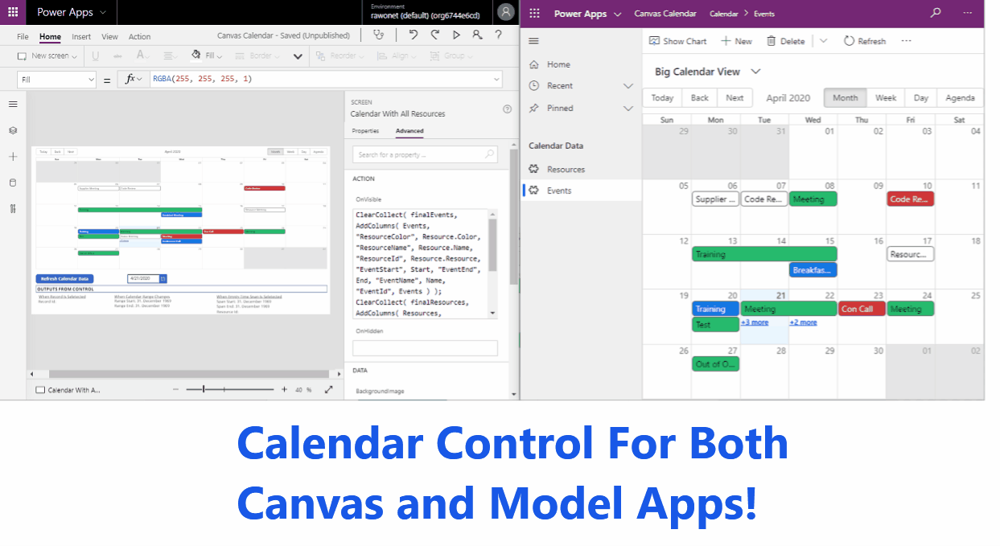

Canvas
- To ensure data loads correctly in Canvas we must use collections instead of CDS datasource directly.
- There are output parameters that are defined in the app which will pass back data when an item is clicked on, an empty time span is selected, or the calendar range has been updated.  These output parameters will allow you to create your own functionality in the Canvas app for updated or creating records.
- To set the default language for the calendar you can utilize the Language() function to pass the users current browser language into the calendarLanguage property.

Model
- Clicking on and event will open the record for editing.
- Clicking on an empty timespan will open a new record form, and will pass in the start, end, and resource field data.
- Calendar will default to the users currently selected language in their users settings if that language is available otherwise it will utilize English.

# Sample Application
If you would like to try this component download the sample solution below which includes a Model and Canvas app you can utilize.

[Download Sample App](https://github.com/rwilson504/PCFControls/raw/master/Calendar/Sample/CanvasCalendar_1_0_0_4_managed.zip)

# Model Configuration
To add the calendar in a model view you can do the following.

Create a new view or select an existing one.  You need to make sure that any columns you utilize in the control properties are in the view.
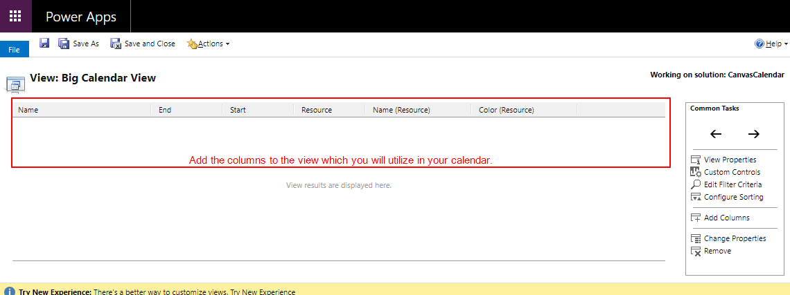

Click to add the custom control
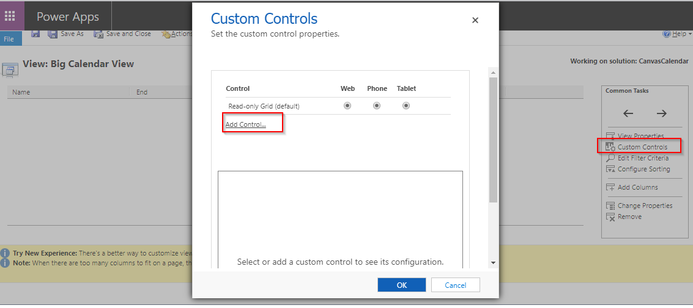

Select the Calendar Control
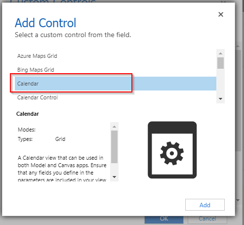

Choose the places you want the control to show up such as web or tablet.  Then begin to modify the properties of the control.
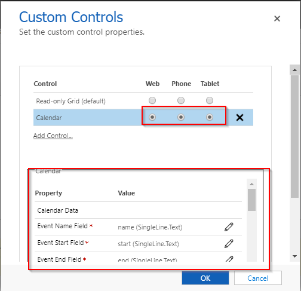

After you are done save the view and do a Publish All.

If at first you don't see the control on the view you created do the following.

Select the ellipsis and do Show As
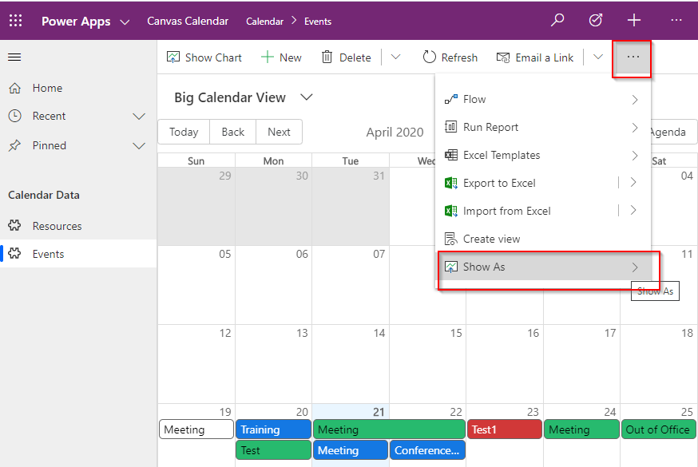

Select the Calendar Control


Set the properties of the control.
- **Event Name Field** This will be the title for the events.  Enter the logical name of the attribute in this fields. Ex. raw_name
- **Event Start Field** This will be the start time for the events.  Enter the logical name of the attribute in this fields. Ex. raw_start
- **Event End Field** This will be the end time for the events.  Enter the logical name of the attribute in this fields. Ex. raw_end
- **Event Color Field** This will change the color of the event.  You can use a color field on the event or you can utilize a color field from the resources. Enter the logical name of the attribute.  Ex. on Event raw_color, Ex. on Resource raw_resource.raw_color.
- **Default Event Background Color** Specify the default background color for events if not using a field to define the color. Value should be in Hex color format, eg. #3174ad
- **Event Id Field** (Do Not Use In Model, for Canvas Only were data is supplied by a collection)
- **Resource Field** If you want to utilize resources enter the logical name of the lookup field for the Resource.
- **Resource Name** To use a name field for the resource that is not the default name field you can enter it here. Ex. raw_resource.raw_specialname.  Otherwise you can leave this blank and it will use data from the default name field.
- **Week Start Day** Select the day the week should start on.  If left blank or 0 this will be based upon your locale. (1=Sunday, 2=Monday, 3=Tuesday, 4=Wednesday, 5=Thursday, 6=Friday, 7=Saturday)
- **Work Week Days** Select the days you would like to show on the work week.  For example enter 2,4,6 to only show Monday, Wednesday, and Friday.  If left blank it will display Monday-Friday. (1=Sunday, 2=Monday, 3=Tuesday, 4=Wednesday, 5=Thursday, 6=Friday, 7=Saturday)
- **Get All Resources** Determines if all resources will be returned even those that don't have any events on the calendar.  Possible values are true or false.
- **Today Background Color** Sets the background color for the time slots that cover todays date.
- **Default Calendar View** Set the default calendar view.  Possible values are "month", "week", "work_week", "day", "agenda"
- **Calendar Date** (Do Not Use In Model, for Canvas Only)
- **Calendar Language** Allows you to set the default language/culture for the calendar.  If you leave this blank it will default to the users current language in Dynamics if it's available or you can specify a language if you always want the calendar to show up in that language.

## Using In Sub-Grid
If using this control in a Sub-Grid you will need to add it to the form using the Classic Editor.

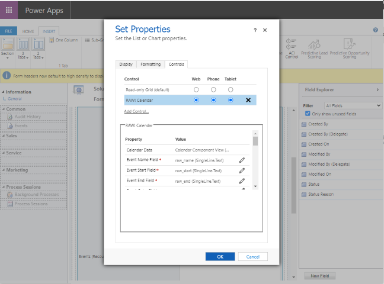

To set the height for the calendar update the number of rows the subgrid should take up.
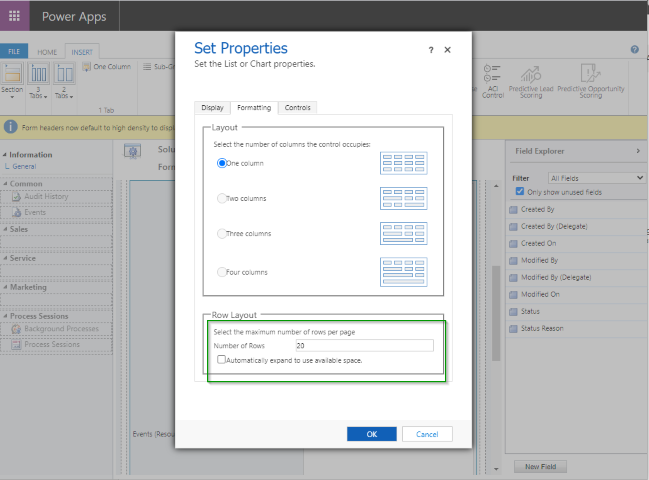

# Canvas Configuration
Using the control in Canvas requires more configuration due to the limitations and differences inherit between Model and Canvas apps.  In a canvas app the actions such as creating a new record or updating an existing one need to be implemented by the person creating the app.  The control will provide you with output which will allow you to access data from the calendar and complete those interactions.

*Important Notes:*

- Using Code Components in a canvas app is currently in pre-release.  You will need to follow [these directions](https://docs.microsoft.com/en-us/powerapps/developer/component-framework/component-framework-for-canvas-apps) in order to enable this feature within your environment.
- After you drop the calendar control onto your Canvas app or update any of the controls properties make sure that you close and re-open the app in the PowerApps Editor to see the changes reflected.
- When adding the control to the form it will have a long name like raw_RAW.Calendar.Calendar(00000001-0000-0000-0001-00000000009b1) rename it to something simple like Calendar Control
- Because PCF Code components are not currently in Preview from Microsoft there are some paging bugs that limit the number of records return when using a CDS entity directly, instead you will need to utilize a Collection to get the data. directions on how to do this are below.

## Events Only
To just get the events and display them on the calendar we must utilize a simple collection to get all the events.  Because Canvas have some paging issues right now we will need to load the CDS data into a collection, otherwise the number of records will be constrained to 25.

The following code can be added to the OnVisible event of the Canvas form or to a Toggle switch that can update the data when it's been checked..  The collection name will be calendarEvents and the CDS entity we are pulling from is called Events.  Additionally you can add filters when creating the Events entity if you would like to only show certain events.

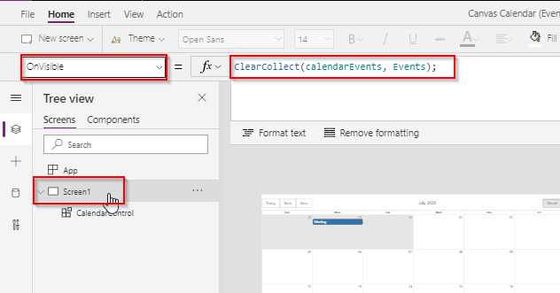

```
ClearCollect(calendarEvents, Events)
);
```

Here is the data source selection on the control.
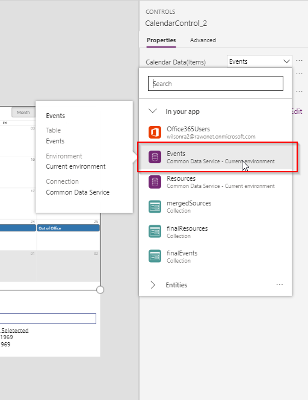

Here are the input properties for the control.  If the eventId property is not filled in correctly you will not get the proper record guid when you select a record, this is only required in Canvas apps.
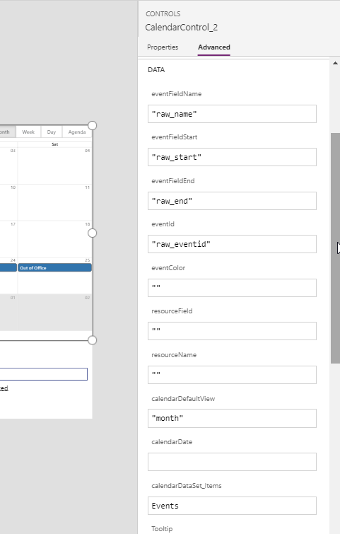

## Events and Resources
To get Events and Resource data we will need to utilize more complex Collections to pull all of our data together.  This is due to how Canvas app pull back data for lookups.

### Return Only Resources That Have Events
The configuration below will load the Events and include information about their resources. Also because we will be utilizing a control you will need to add in the EventId and set that parameter on the control. 

Here you can see that there are 5 resources in our Resource data.
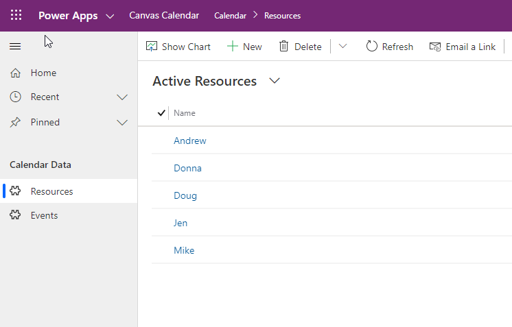

In the resource Day view of the calendar though it only shows 4 resources because Andrew doesn't have any events.
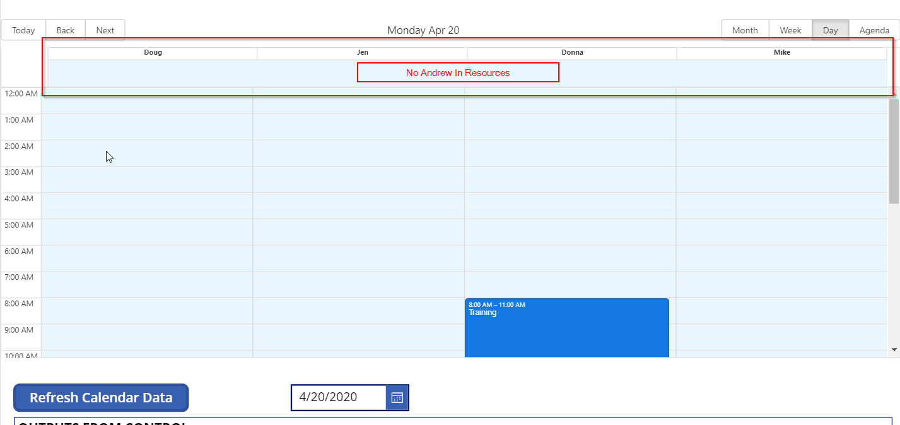

The following code can be added to the OnVisible event of the Canvas form.

```
//Since the Resources are from a related entity it is best to create a 
// collection and create our own columns to make sure we don't end up with 
// some Canvas issues such as related data not showing up in the dataset.
ClearCollect(
    finalEvents,
    AddColumns(
        Events,
        "ResourceColor",
        Resource.Color,
        "ResourceName",
        Resource.Name,
        "ResourceId",
        Resource.Resource,
        "EventStart",
        Start,
        "EventEnd",
        End,
        "EventName",
        Name,
        "EventId",
        Events
    )
);
```

Here is the data source selection on the control.


Here are the input properties for the control
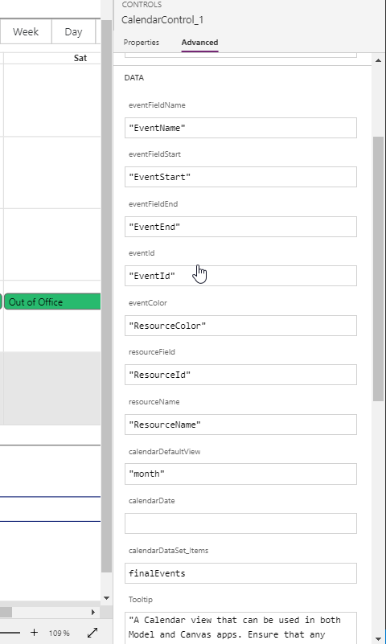


### Return All Resources and Events
To return all resources including those who don't have any events for the current time period you will need to perform some additional work on the Collection. 

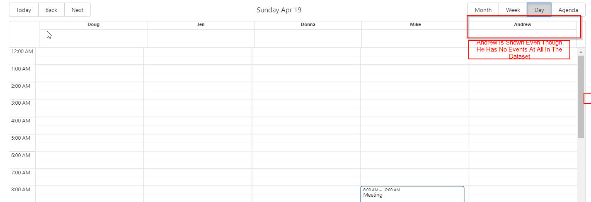

The following code can be added to the OnVisible event of the Canvas form.

```
//Clear and create a collection which will hold our events.  We need to 
// add and map data to additional columns so we can join all the data 
// together in the end and it get's us around a lot of the issues we run into 
// with Canvas app such as Lookup data not being included in the dataset.
ClearCollect(
    finalEvents,
    AddColumns(
        Events,
        "ResourceColor",
        Resource.Color,
        "ResourceName",
        Resource.Name,
        "ResourceId",
        Resource.Resource,
        "EventStart",
        Start,
        "EventEnd",
        End,
        "EventName",
        Name,
        "EventId",
        Events
    )
);
//Create the resource collection.  This collection will include all 
// resources in the system so that we will get resources on the calendar 
// that do not have events.
ClearCollect(
    finalResources,
    AddColumns(
        Resources,
        "ResourceColor",
        Color,
        "ResourceName",
        Name,
        "ResourceId",
        Resource
    )
);
//Create a new merged collection containing the events
ClearCollect(mergedSources, finalEvents);
//Now add the Resources to the collection.
Collect(mergedSources, finalResources);
```

Here is the data source selection on the control.
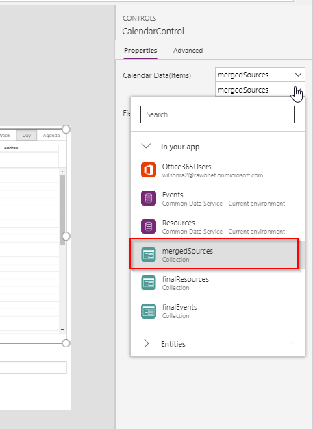

Here are the input properties for the control
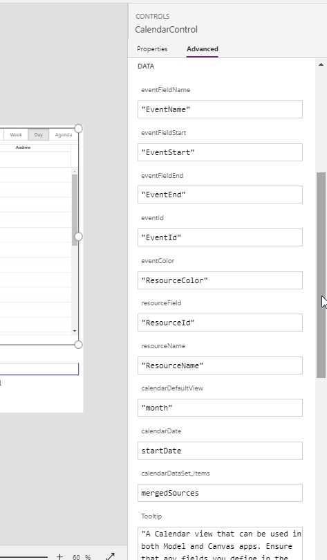

## OnChange Event
The data returned from the control will be attached to the Canvas Control element.  There are currently 3 defined types of output changes that occur.

* RecordSelection, occurs whenever a user clicks on a calendar event.
    * .actionRecordSelected, This value will be set to true when the action happens.
    * .selectedRecordId, The id of the record selected.
* TimSlotSelected, occurs when a user select an empty area on the calendar.  It will return the timespan for the selection. 
    * .actionSlotSelected, This value will be set to true when the action happens. 
    * .selectedSlotStart, The start time of the empty slot selected. 
    * .selectedSlotEnd, The end time of the empty slot selected. 
    * .selectedSlotResourceId, If the time slot was on a view showing the resources the Id of that Resource will be provided.
* RangeChange, when a user click on the next/back buttons or updates a view on the calendar
    * .currentRangeStart, The current start time show on the calendar view.
    * .currentRangeStart, The current end time show on the calendar view.
* DateChange, when the current date of the calendar changes    
    * .currentCalendarDate, The current date of the calendar control

This is an example of a text box with the Default values set the .selectedRecordId property of the control.
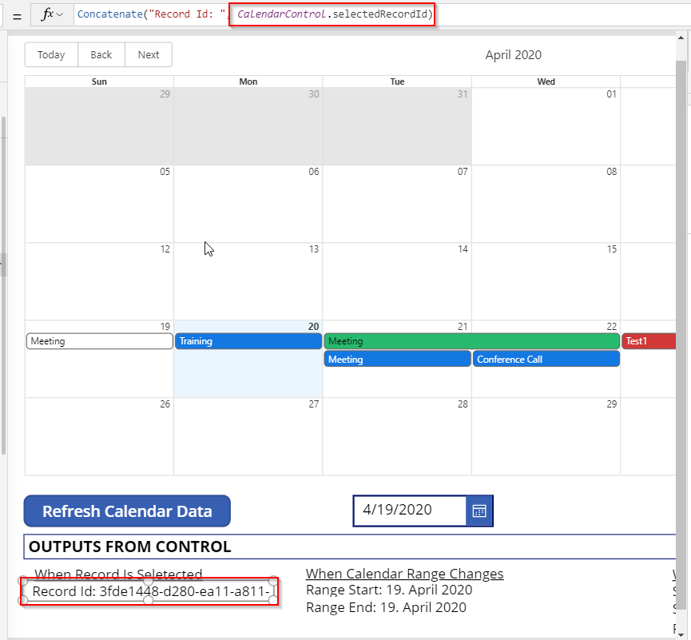

This is an example of the OnChange event on the Calendar Control which will allow you to do things such as open a form to create a new record or update and existing one.

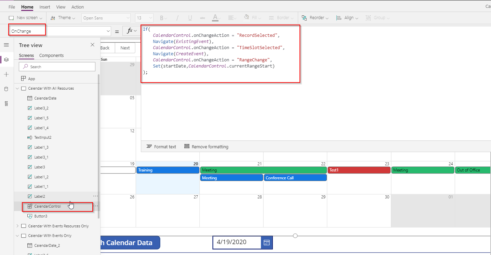

## Setting the Calendar Date
If you would like to set the Calendar date to something other than Today you can do so in two ways.  If you leave the calendarDate property on the control empty it will default to Today.

### Default On App Load
The first way is if you just want to default the calendar once upon app load.  In this case you can set a variable during the OnStart of your app.

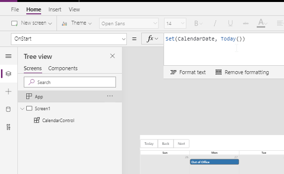

Next set the calendarDate property in the Calendar Control on your form.

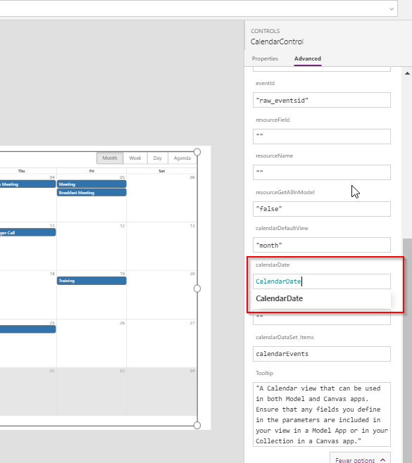

Finally you will need to make sure the OnChange handler of the control updates the CalendarDate variable every time the calendar date changes. Otherwise every time you try to move forward or back the calendar will just go right back to your original date.

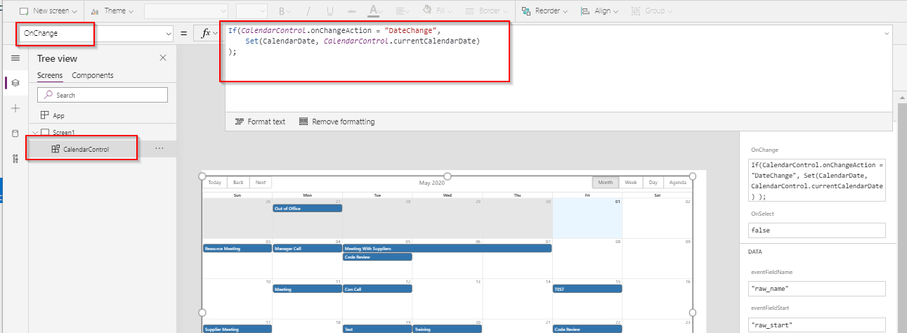

### Allow User to Select Date
To allow the user control of the calendar date you can utilize a Date control.

First start by creating a variable on the OnStart of your application and setting the default date you would like to have.


Next set the calendarDate property in the Calendar Control on your form.


Add a Date control on your form. Set it's Default proper to the variable you created earlier and set it's OnSelect event to update that variable with any newly selected date in the control.

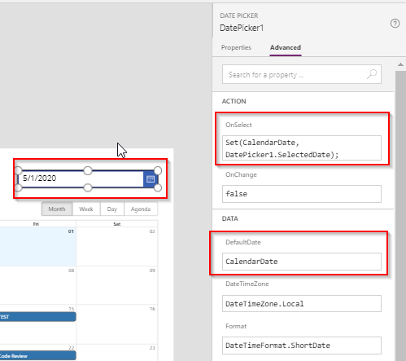

Now if the user selects a new day the calendar will forward to that date.