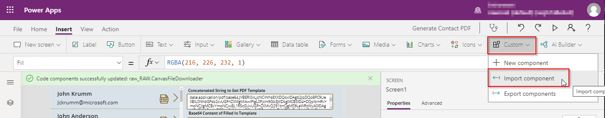
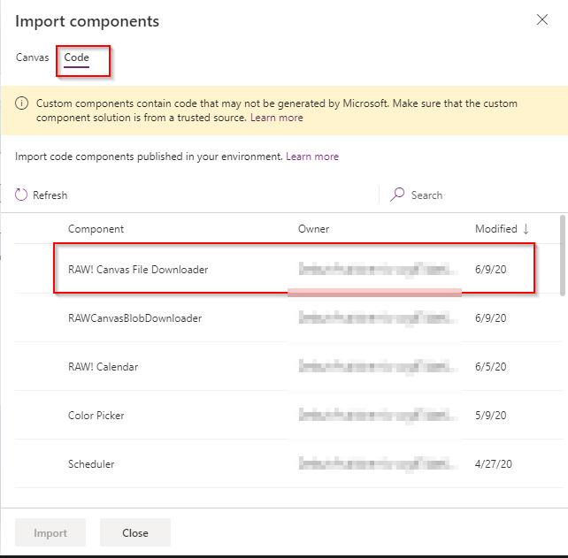
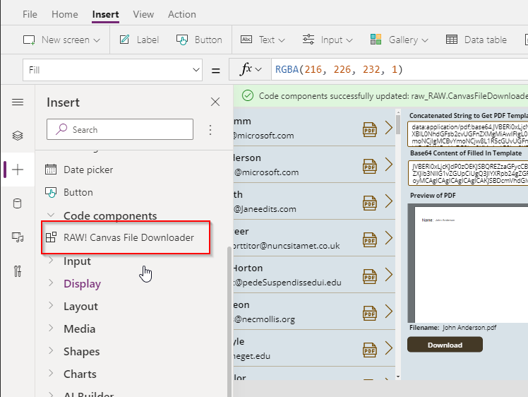
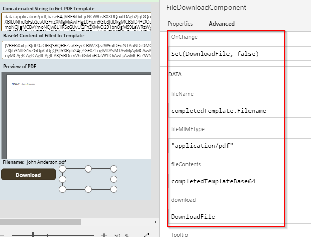
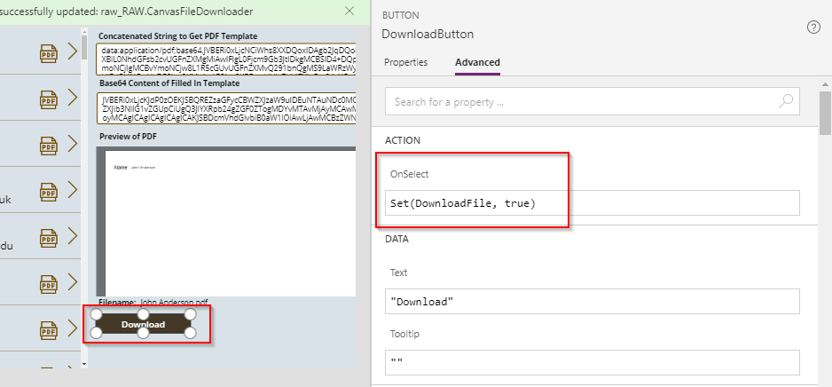
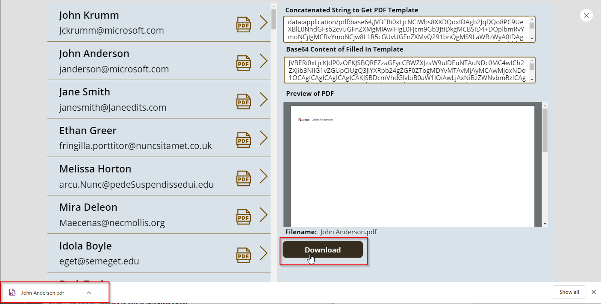

In Canvas apps the Launch and Download function require that you supply a URL to download a file.  This control will allow you to download a file to the client computer in a Canvas Power App by supplying it's base64 content string instead of a Url.

## How to Configure

* Make sure you have enabled PCF components for Canvas apps in your environment.  For instructions on that [Click Here](https://docs.microsoft.com/en-us/powerapps/developer/component-framework/component-framework-for-canvas-apps)

* In the Power Apps Editor ribbon navigate to **Insert -> Custom -> Import Components**


* On the Import Component screen select the **Code** tab and Import the **RAW! Canvas File Downloader**


* Open the **Code components** area in the Insert panel and add the **RAW! Canvas File Downloader** component to the form.  The control itself will just be a blank space on the form you can utilize any other control within Canvas that has an OnSelect function to fire off the component.


* Click on the Component on the form and set the Properties for the component.
    * fileName (string): This will be the file name which the browser will download the content as.
    * fileMIMEType (string): Set the MIME type of the file being downloaded.  Eg. application/pdf
    * fileContents (string): This needs to be the base64 string that represents the file.
    * download (boolean): When set to true the file will be downloaded to the client.
    * OnChange: Can be used to reset the Global variable being used by the download property.

    In the example I'm using the File Download Component is being used to download a PDF document.  The download property has been set to a Global variable called Download file which will get changed to true when the Download button is clicked.  The OnChange event will reset the Global variable back to false after the component download the file.
    

* Add a control onto your form such as a button and use it's OnSelect function to set the Global variable assigned to the download property to true, this will start the file download to the client.


* After the Global variable for download gets set to true the file will be downloaded.


## Convert Blob to Base64 String
If you are utilizing a connect which returns a Blob object you can utilize the JSON function to convert that blob to a string.  Below is the code I utilized to convert a Blob produced by the Encodian connector.

``` 
//Send our PDF template to Encodian to fill in all the form fields.
Set(completedTemplate, Encodian.FillPdfForm(Concatenate('Full Name', ".pdf"), {FileContent:TextInput1, formData:JSON({Name: 'Full Name'})}));

//Take the returned file contents in Blob format and convert it 
// to a base64 string utilizing the JSON function in Canvas.
// Remove the quotes produced by the JSON function.
Set(completedTemplateBase64,Substitute(JSON(completedTemplate.FileContent,JSONFormat.IncludeBinaryData),"""", ""));

// Remove the data:application/octet-stream;base64, header from the base64 string so that we left with only the base64 content string.
Set(completedTemplateBase64,Substitute(completedTemplateBase64,"data:application/octet-stream;base64,", ""));
```