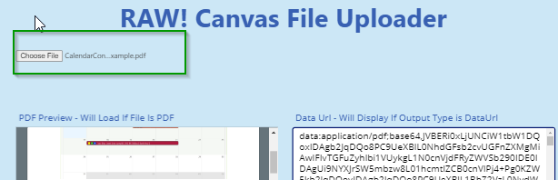
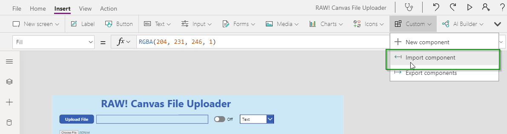
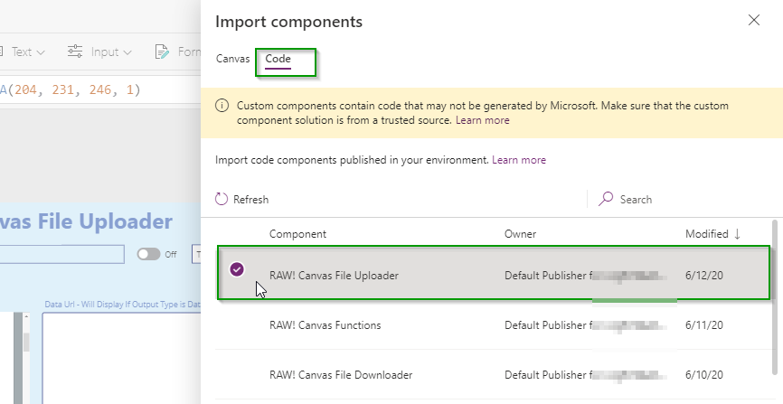
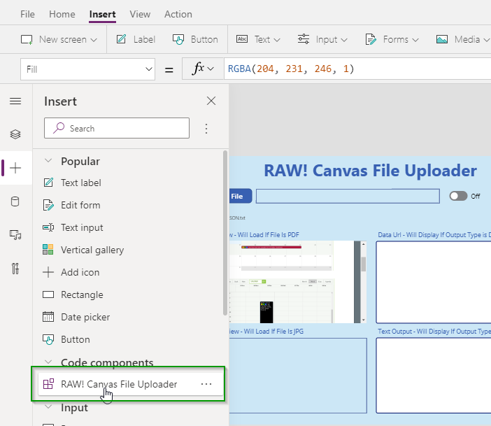
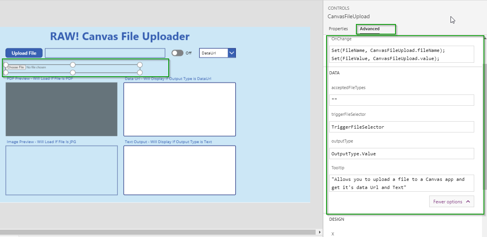
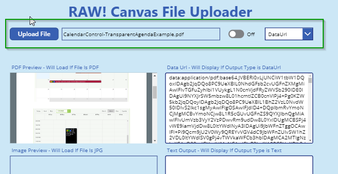
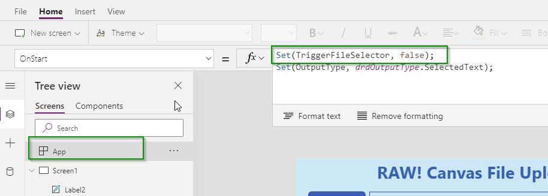
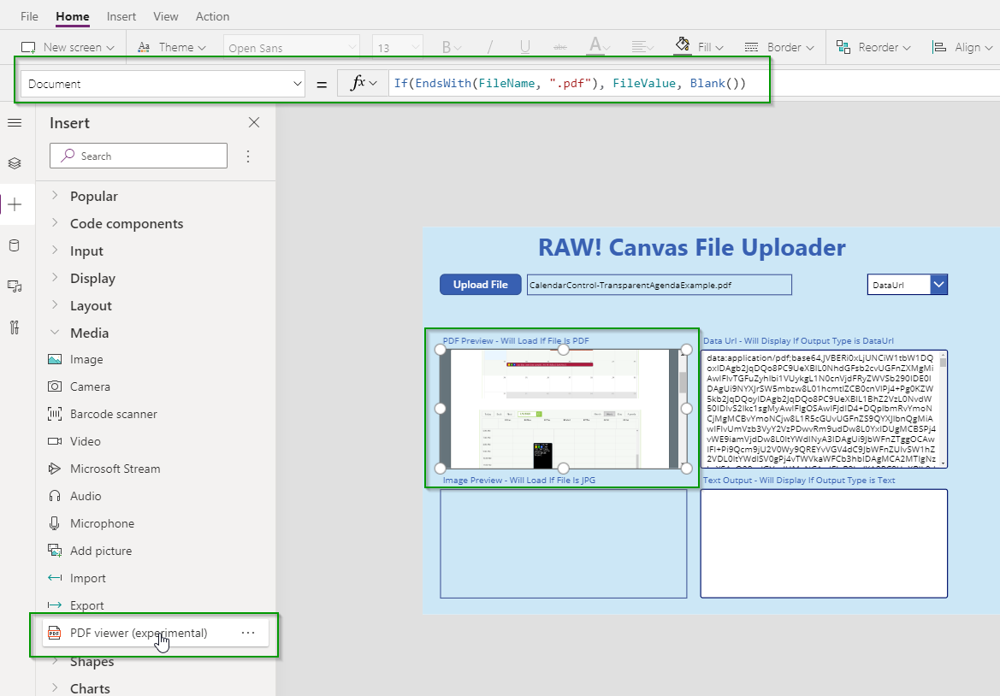
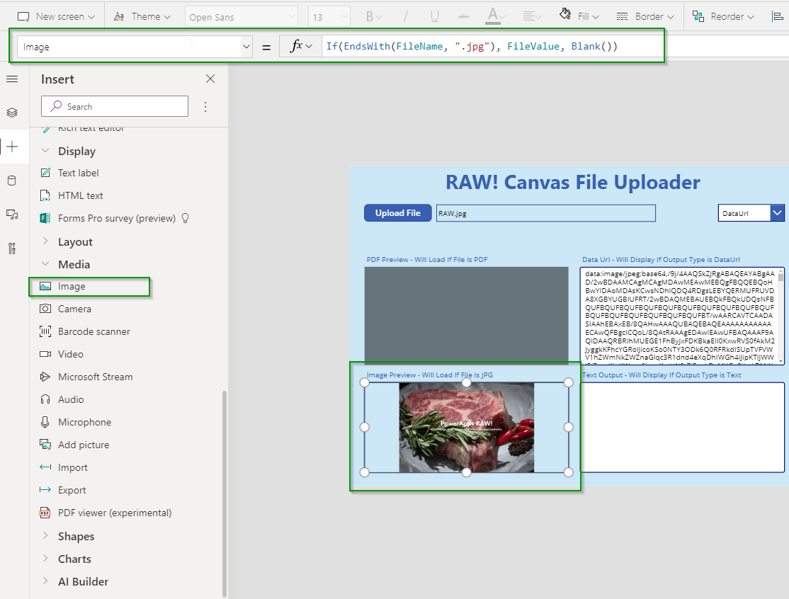

The component allows you to upload a file from your computer into a canvas app and return the Data Url or the Text of the file.  Data Urls in Canvas apps can be utilizes to populate other controls such as the Image or PDF viewer controls.  The text output allows you view the text contents of a file, which could be very useful in things like loading simple text, JSON, or HTML.


# Configuration
This control was designed to allow the Canvas app developer to utilize either a standard HTML file input control or to utilize other build in Canvas controls such as Buttons, Check Boxes, Toggles, etc to control this component.  That allows the Canvas developer full control over the look and feel of the app.

## Default Configuration
The default configuration will display a standard HTML file input control.


* Make sure you have enabled PDF control for Canvas apps in your environment.  For instructions on that [Click Here](https://docs.microsoft.com/en-us/powerapps/developer/component-framework/component-framework-for-canvas-apps)

* In the Power Apps Editor navigate **Custom -> Import Components**


* On the Import Component screen select the **Code** tab and Import the **RAW! Canvas File Uploader**


* Open the **Code components** area in the Insert panel and add the **RAW! Canvas File Uploader** component to the form.  


* Click on the Component on the form and set the Properties for the component.
    * **acceptedFileTypes** (string): This can be used to limit the file types that the user can select from when browsing for files.  This is a comma delimited string of values, (eg: .txt, .pdf, .html).  To learn more about usage of this [click here](https://www.w3schools.com/tags/att_input_accept.asp)
    * **triggerFileSelected** (boolean): This property can be utilized to open the file selected programatically in Canvas without the user clicking the "Choose File" button.  For more information see the section below called "Configure Using Canvas Button and Label"
    * **outputType** (Enum): Here you can determine what output is supplied after the file is selected.  The are two options to select from.
        * DataUrl - Returns a data url of the file in base64 format.  This string format can be utilized to set other controls in Canvas such as the image control or the PDF viewer component.  Canvas apps know how to translate these data urls into files.  These data urls can also be used in a Patch function on a CDS entity to create annotations or set file fields.
        * Text - Returns the text represenation of the file.  This can be very useful for .txt files or any of type of simple file.  You could use this to load JSON configuration or HTML into your app.
    * **OnChange**: After the file is selected the files name and content will be returned in two output variables called **fileName** and **value**.  To utilize these output variables set Canvas variables to their value in the OnChange event.
    


## Configure Using Canvas Button and Label
The standard HTML file input may not meet your needs for look/feel of your application.  This component was designed to allow you to interact with it utilizing the already available Canvas controls that you are used to.  Below is a demonstration on how to configure the Component utilizing a Canvas Button, Text Box, and Toggle control.



* To begin open the App -> OnStart function and set a variable for trigering the file browser to false.


* Add a Toggle control to your form and update the following properties.  This Toggle will be used to open the file selector. It is important to utilize a Toggle otherwise the async nature of Canvas apps will not correctly set your TriggerFileSelector to the proper value after the selector is opened.
    * OnCheck: 
        ```
        Set(TriggerFileSelector, true);
        ```
    * OnUncheck: 
        ```
        Set(TriggerFileSelector, false);
        ```
    * Default: 
        ```
        ToggleChecked
        ```
    * Visible: 
        ```
        false
        ```
* Add a Button to your form and update the following properties.  This button will be used to check/uncheck the Toggle which will open the file selector.
    * OnSelect:
        ```
        Set(ToggleChecked, true);
        Set(ToggleChecked, false);
        ```

* Add a Text Input or Text Label to your form if you want to display the File name that was selected.  Updates it's properties.
    * Text:
        ```
        FileName
        ```

* If you want to allow the user to change the output type in the app you can add a Drop Down also.  Set the properties as follows.
    * Items:
        ```
        'RAW.CanvasFileUploader.outputType'.DataUrl, 'RAW.CanvasFileUploader.outputType'.Text]
        ```
    * OnChange
        ```
        Set(OutputType, drdOutputType.SelectedText);
        ```

* Finally we can update the confiration of the RAW! Canvas File Uploader component to make it not visible and set it's properties.  Start by renameing the component in the editor.  In this example it's called CanvasFileUpload
    * OnChange: 
        ```
        Set(FileName, CanvasFileUpload.fileName);
        Set(FileValue, CanvasFileUpload.value);
        ```
    * triggerFileSelector:
        ```
        TriggerFileSelector
        ```
    * outputType
        ```
        OutputType.Value
        ```
    * Visible:
        ```
        false
        ```
        
* You can now utilize the FileName and FileValue variables you set in the OnChange of the RAW! Canvas File Uploader component to show your data.  If you want to keep it simple you can just add a text box and display the FileValue.  If you have your Output Type set to DataUrl then the FileValue can be used with other components.  For example if you drop the **PDF Viewer** control under the Media area you can set it's Document property to FileValue and if the document is a PDF then is will be displayed. Another example is the Image Viewer, by just setting the Image property to FileValue you can see the image that was selected.

