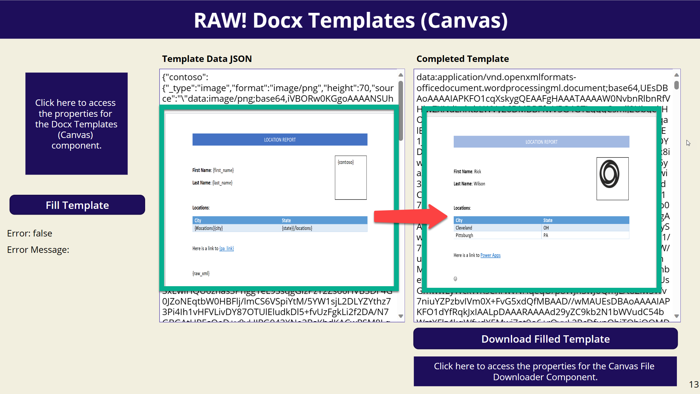

This component will allow you to fill in a Docx template within a Canvas App.  The component utilizes the [easy-template-x](https://github.com/alonrbar/easy-template-x) open source library.  For examples of how to create a template and how to structure the templateData property check out the easy-template-x [README](https://github.com/alonrbar/easy-template-x#live-demo) file.



## Installation/Usage

[Download](https://github.com/rwilson504/PCFControls/releases/latest/download/RAWDocxTemplatesCanvas_managed.zip) and import the managed solution into your environment.

* Make sure you have enabled PCF components for Canvas apps in your environment.  For instructions on that [Click Here](https://docs.microsoft.com/en-us/powerapps/developer/component-framework/component-framework-for-canvas-apps)

## Sample Application
If you would like to try this component download the sample solution which includes a Canvas app containing a sample Docx.


* This sample solution also contains the **!RAW Docx Template (Canvas)** components as well as the **!RAW Canvas File Downloader** compoenents.  If you plan to use the sample solution make sure you do not have these components already installed in your environment.
* You will find the docx template and contoso image file used for the sample in the Media section of the Power Apps editor.  The docx file was renamed to .png because .docx files are not accepted for upload in the Media section.

[Download Sample App](https://github.com/rwilson504/PCFControls/raw/master/DocxTemplatesCanvas/Sample/DocxTemplateSample_1_0_0_1_managed.zip)

## Usage Instructions

* In the Power Apps Editor ribbon navigate to **Insert -> Custom -> Import Components**    

* On the Import Component screen select the **Code** tab and Import the **RAW! Docx Templates (Canvas)**

* Open the **Code components** area in the Insert panel and add the **RAW! Docx Templates (Canvas)** component to the form.  The control itself will just be a blank space on the form.  It is suggested you rename the Component you dropped on the form to make it easier to access.

* Click on the Component on the form and set the input properties for the component.
    * docxTemplate (string): Provide the contents of the Docx template in Base64 format.
    * fillTemplate (bool): Set this to a variable which will eventually be set to true by an action within your application such as a button being clicked.
    * templateData (string): This is the collection of items which will fill the form.  Create an object within your canvas app then convert it to a string using the JSON function.
    ```
        Collect(locationData, {city: "Cleveland", state: "OH"},{city: "Pittsburgh", state: "PA"});
        Set(templateData,
            JSON({
                        first_name: "Rick",
                        last_name: "Wilson",
                        locations:  locationData,
                        contoso: {
                            _type: "image",
                            source: JSON(contoso, JSONFormat.IncludeBinaryData),
                            format: "image/png",
                            width: 70,
                            height: 70
                        },
                        pa_link: {
                            _type: "link",
                            text: "Power Apps", // optional - if not specified the `target` property will be used
                            target: "https://powerapps.microsoft.com"
                        },
                        raw_xml: {
                            _type: "rawXml",
                            xml: "<w:sym w:font='Wingdings' w:char='F04A'/>",
                            replaceParagraph: false  // optional - should the plugin replace an entire paragraph or just the tag itself
                        }
                })
        );
    ```
        * OnChange: You can utilize the OnChange event to complete other actions each time the component fills out a template.  For example you will probably want to reset the filleTemplate variable to false so that you can run the template fill action again.
        ```
            Set(fillTemplate, false);
        ```

* There are several output properties which are described below.
    * docxOutput (string): This property will contain the base64 string of the completed template with the combined data.
    * outputError (bool): If there is an error while filling in the template this will be true.
    * outputErrorMessage (string): This is the detailed message if there is an error filling in the template.

* You can download the completed template using my [Canvas File Downloader](https://github.com/rwilson504/PCFControls/tree/master/CanvasFileDownloader) component.  You can also use the base64 output to upload to SharePoint or another service.