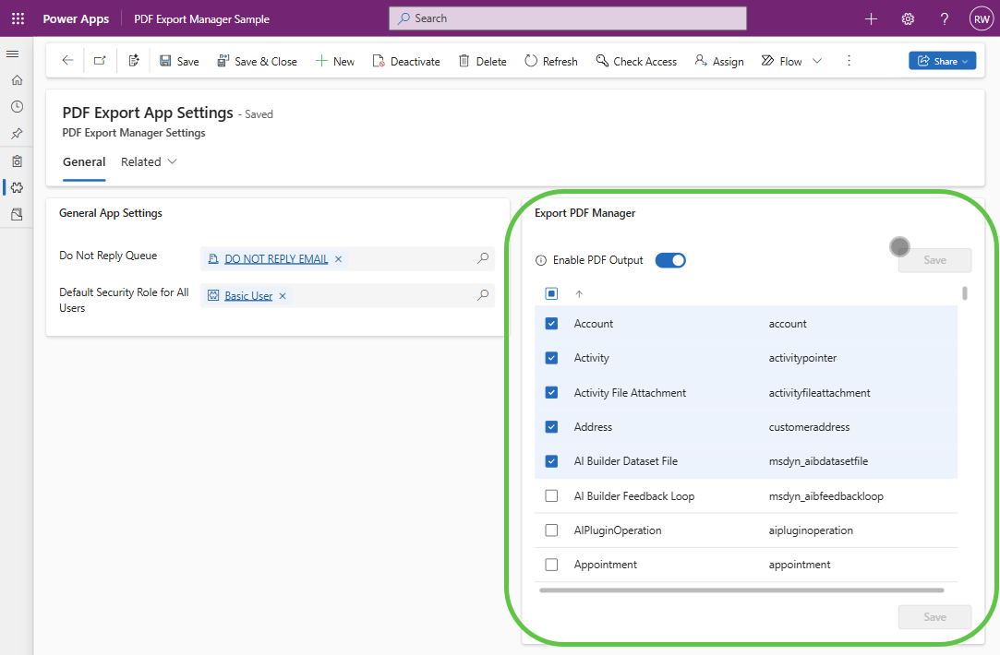
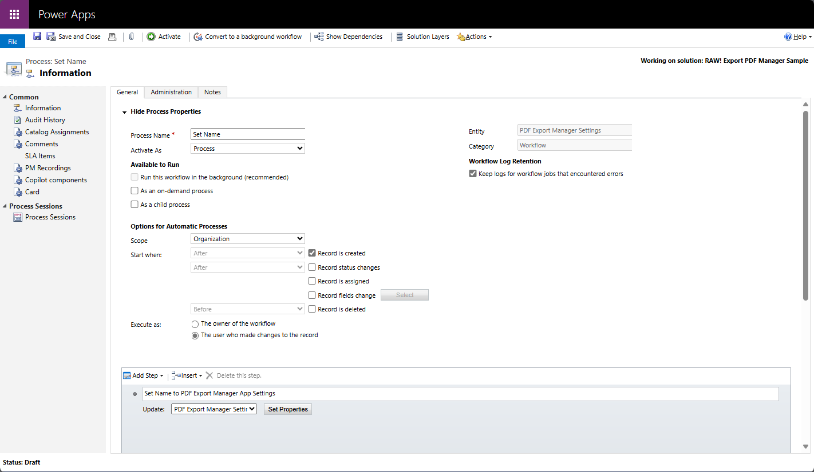
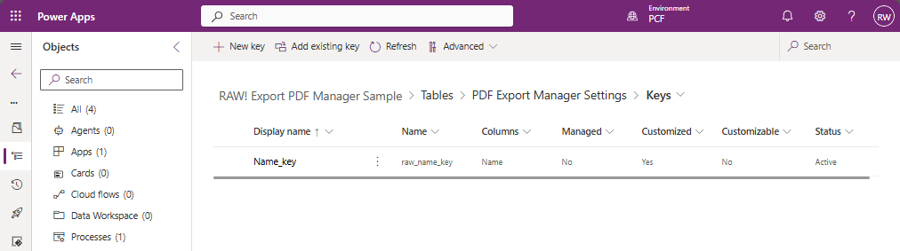
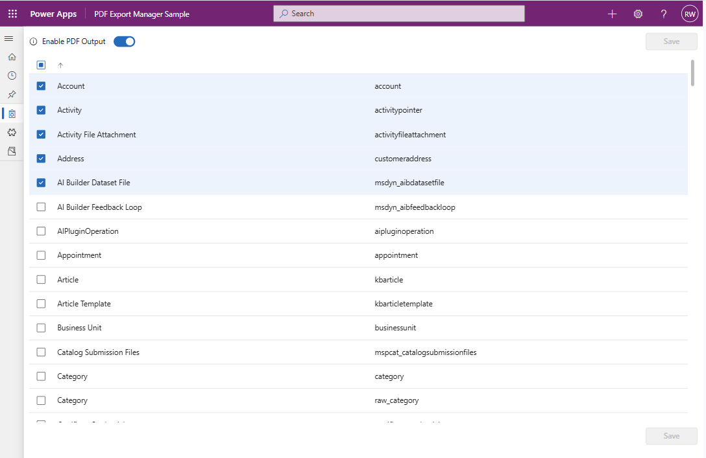

# Export PDF Manager Control


## Introduction
The Export PDF Manager Control is a Power Apps Component Framework (PCF) control designed to simplify the management and configuration of the "Export to PDF" functionality within model-driven apps. This control provides an intuitive interface to enable or disable PDF export capabilities, configure PDF generation settings, and manage visibility and availability of the Export to PDF button based on specific business requirements.

This control is particularly useful for administrators and developers who need to quickly adjust PDF export settings without manually editing XML or using complex scripts. It streamlines the process of enabling PDF export functionality, ensuring consistency and reducing the risk of errors. While there are other ways to configure the Export to PDF functionality, as detailed in my [original article](https://www.richardawilson.com/2021/06/enable-export-to-pdf-button-ribbon.html), this PCF control makes it much easier, especially for those who are not using Dynamics but just Power Apps model apps.

> **Note**: If you don't see your changes reflected after updating, the settings may be stored in the session storage. Make sure to run `sessionStorage.clear()` in your browser's developer console to ensure the buttons on the entities are updated or enabled.

## Features
- **Enable/Disable Export to PDF**: Quickly toggle the availability of the Export to PDF button.
- **Non-Dynamics Environment Support**: Allows for modifying the PDF settings even if the environment is not enabled for Dynamics Apps, making it ideal for custom model apps.
- **Dynamic Configuration**: Adjust PDF export settings dynamically based on form context or user roles.
- **Ribbon Customization**: Easily manage ribbon visibility and button availability without manual XML editing.
- **Fluent UI Integration**: Built using Fluent UI 9 for a consistent and modern user experience.
- **Multi-language Support**: Supports multiple languages including English, Spanish, French, Korean, Japanese, German, Portuguese, and Arabic.
- **Theme Support**: Adapts seamlessly to the built-in model-driven app theme or custom themes applied in canvas apps.


## Available Properties

| Property Name  | Description                                                | Type            | Default Value |
|----------------|------------------------------------------------------------|-----------------|---------------|
| boundProperty  | The primary bound property for the control context.        | SingleLine.Text | N/A           |
| height         | Height of the control in pixels.                           | Whole.None      | 500           |

## Installation

[Download Latest](https://github.com/rwilson504/PCFControls/releases/latest/download/ExportPDFManager_managed.zip)

[Import the solution file](https://learn.microsoft.com/en-us/power-apps/maker/data-platform/import-update-export-solutions)

### Model-driven Apps
[Implementing code components for Model-driven Apps](https://learn.microsoft.com/en-us/power-apps/developer/component-framework/code-components-model-driven-apps#implementing-code-components)

## Usage

### Using a Settings Entity
For model apps, I typcialy use a Settings entity to store configuration values such as default queues for sending emails or teams used for specific processes. This entity can be used in workflows and flows to avoid defining these values in each one.



1. **Set the Name Field to Optional**: When creating the Settings entity, set the Name field to optional. This ensures that it is not required during record creation.

2. **Hide or Remove the Name Field from the Form**: After setting the Name field to optional, hide it or remove it from the form to prevent users from manually entering a value.

3. **Create a Real-time Workflow**: Create a real-time workflow on creation to automatically set the Name field to "Settings". Ensure there is space here for an image illustrating the workflow configuration.



4. **Add a Key on the Name Field**: Create a key on the Name field to prevent admins from accidentally creating more than one record. Below is an example of the Key screen:

You can place this PCF component on the Settings entity to manage the Export to PDF functionality centrally.



### Using as a Full-Page Component
You can also use this control as a full-page component linked directly from the sitemap. A huge thank you to [Andrew Butenko](https://www.linkedin.com/in/andriibutenko/) for posting this solution for PCF components. [Read more here](https://butenko.pro/2025/03/31/pcf-direct-embedding-of-controls-into-sitemap/).



To configure this:

1. Open the sitemap editor in your model-driven app.
2. Add a new navigation link with the following URL:
   ```
   /main.aspx?pagetype=control&controlName=raw_RAW.ExportPDFManager&data=%7B"fullPage"%3A"true"%7D
   ```
3. Save and publish your changes.

This will allow users to access the Export PDF Manager control as a standalone page directly from the app's navigation menu.
