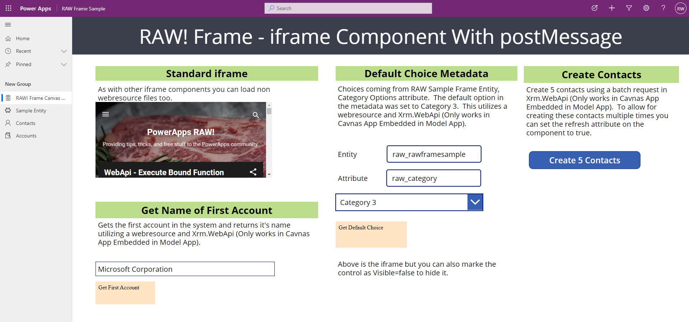

## Overview
The RAW! Frame component can be used to display another webpage within your Canvas App.  It is similar to many of the other iframe components out there but with one exception, that you can return data from the page you load into it. For example if your Canvas app is embedded within a Model app you could load webresource page into the iframe to gain access to the WebAPI and return data utilizing the controls output.

The origin of the component is from a requirement to return the default Choice value in the CDS metadata within a Canvas app.  The only way to get this data within a Canvas app is to utilize Power Automate.  The Canvas app being developed was contained within a Model application, [see how to do that here](https://www.richardawilson.com/2020/06/launch-canvas-app-in-model-app-from.html).  Because the Canvas app is hosted within a Model app the a webresource can access the Xrm object from the Model app and the session security already in place will allow you make the call. 

## Sample Application
I have included a sample solution which includes a Model and Canvas app that will allow you to see how the functionality works.  You can download it below.

Before installing the sample please install the [CDS Environment URL](https://github.com/powerappsdev/CDSEnvironmentURL) PCF which is a pre-requisite for the solution.  This component was developed by [Dan Cox](https://github.com/powerappsdev) and allows you to get the current CDS environment Url in which the Canvas App is running.  By using this component there is no need to hard code webresource addresses which makes it easier to transfer these Canvas apps across environments.

[Download CDS Environment URL](https://github.com/powerappsdev/CDSEnvironmentURL/releases/latest/download/CDSEnvironmentUrlControl_managed.zip)

[Download Sample Solution](https://github.com/rwilson504/PCFControls/raw/master/Frame/Sample/RAWFrameSample_1_0_0_5_managed.zip)

## Configuration

 Make sure you have enabled PCF components for Canvas apps in your environment.  For instructions on that [Click Here](https://docs.microsoft.com/en-us/powerapps/developer/component-framework/component-framework-for-canvas-apps)

* In the Power Apps Editor ribbon navigate to **Insert -> Custom -> Import Components**

* On the Import Component screen select the **Code** tab and Import the **RAW! Frame**

* Open the **Code components** area in the Insert panel and add the **RAW! Frame** component to the form.  

* Click on the Component on the form and set the Properties for the component.
    * **src** (string): url of the iframe.
    * **refresh** (boolean): This property can be used to refresh the current page in the iframe.
    * **Height** (int): The height of the iframe.
    * **Width** (int) The width of the iframe.
    * **Visible** (boolean) Control the visibility of the iframe.  For instance if you are displaying a webresource which will just be returning data you can set this to false and you will never see the actual page which is loaded.

## Send Message Back From Frame
The method used to send data back to the component is the javascript [postMessage](https://developer.mozilla.org/en-US/docs/Web/API/Window/postMessage) function.  This function allows for safely enabling cross-origin communications between frames.

Below is the example code webresrouce which will be loaded into the Frame component.  In this example we are utilizing the Xrm.WebApi to retrieve the first account within our environment and return it's name. After we retrieve the name we then return that data utilizing the window.parent.postMessage function available from the component. Additional example are located in the js folder of this project.

After the postMessage function runs the output parameter, postMessageFromFrame, will contain the string data you pass back.

```
<!DOCTYPE html>
<html>
<head>
    <meta charset='utf-8'>
    <meta http-equiv='X-UA-Compatible' content='IE=edge'>
    <title>Page Title</title>
    <meta name='viewport' content='width=device-width, initial-scale=1'>      
    <script>    
    function getFirstAccount() {        
        top.Xrm.WebApi.online.retrieveMultipleRecords("account", "?$select=name&$top=1").then(
            (result) => {
                if (result.entities.length === 1)
                {
                    let firstAccountName = result.entities[0].name;
                    window.parent.postMessage(firstAccountName, '*');                       
                }
            },
            (error) => {
                window.parent.postMessage(`Error: ${error.message}`, '*');
            }
        );        
    }        
    </script>
</head>
<body onload="getFirstAccount()" style="background-color: bisque;">
    Get First Account
</body>
</html>
```