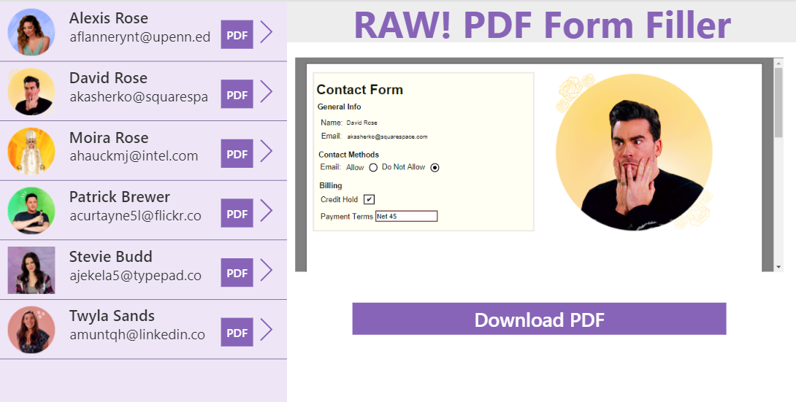
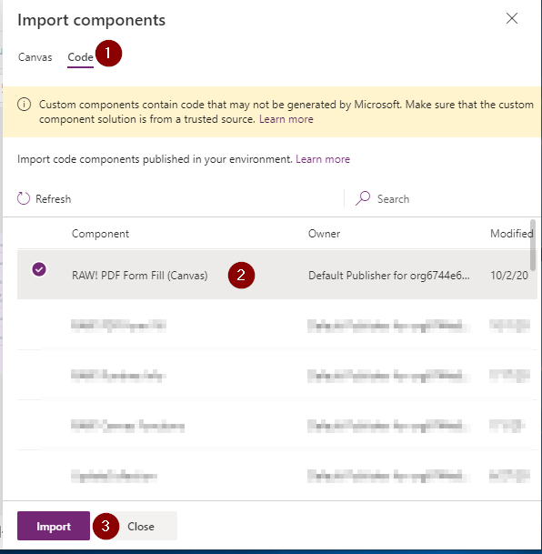

This component will allow you to fill in a PDF Form within a Canvas App without the use of a premium flow connector.  The component utilizes the [PDF-LIB](https://pdf-lib.js.org/) open source library.

## Installation/Usage

[Download Latest](https://github.com/rwilson504/PCFControls/releases/latest/download/RAWPDFFormFillCanvas_managed.zip)

Click on the image below to access the instructional video on how to create a simple Canvas app using the component.

## Sample Application
If you would like to try this component download the sample solution which includes a Canvas app containing a sample PDF.  The sample pdf was generated using [DocFly](https://www.docfly.com/) online PDF creator but you can use whatever PDF generation tool you want.

[Download Sample App](https://github.com/rwilson504/PCFControls/raw/master/PDFFormFillCanvas/Sample/PDFFormFiller_1_0_0_1_managed.zip)

### Additional Information

* Make sure you have enabled PCF components for Canvas apps in your environment.  For instructions on that [Click Here](https://docs.microsoft.com/en-us/powerapps/developer/component-framework/component-framework-for-canvas-apps)

* In the Power Apps Editor ribbon navigate to **Insert -> Custom -> Import Components**
    

* On the Import Component screen select the **Code** tab and Import the **RAW! PDF Form Fill (Canvas)**
    

* Open the **Code components** area in the Insert panel and add the **RAW! PDF Form Fill (Canvas)** component to the form.  The control itself will just be a blank space on the form.  It is suggested you rename the Component you dropped on the form to make it easier to access.

* Click on the Component on the form and set the Properties for the component.
    * pdfTemplate (string): This will be the file name which the browser will download the content as.
    * fillPDF (bool): Set this to true to kick off the PDF form fill.
    * Items (Collection): This is the collection of items which will fill the form.  It needs to be a JSON Collection where each object has two fields name and data (these are case sensitive).  The name field will be the name of the PDF form field and data is the content that will be put in that field.
    ``
        ClearCollect(TestCollect, 
        {name: "Name", data: ThisItem.'Full Name'},
        {name: "Email", data: ThisItem.Email},
        {name: "CreditHold", data:  Text(ThisItem.'Credit Hold')},
        {name: "ContactEmail", data: Text(ThisItem.'Do not allow Emails')},
        {name: "PaymentTerms", data: Text(ThisItem.'Payment Terms')},
        {name: "Photo", data: ImageJSON});
    ``
    * OnChange: Use this to output the final pdf to a variable that be can used by another component such as the PDF Preview.
