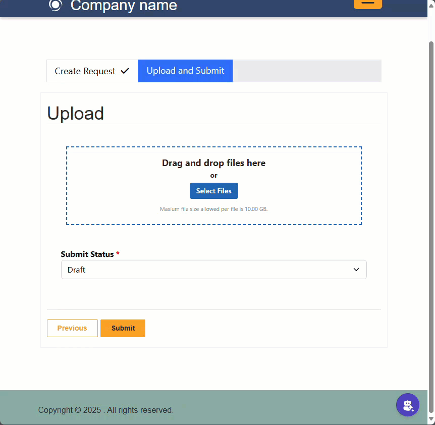

# **Azure Blob Storage File Manager for Power Pages**

## Introduction

This document provides installation steps, setup guidance, and configuration details for the PCF component used for handling file uploads via the Azure File API within Power Pages. This component allows users to upload, download, and manage files stored in an Azure Blob Storage.

Using Azure Blob Storage for file management in Power Pages offers several advantages over other storage solutions like SharePoint:

- **Increased File Size Limit**: SharePoint has a maximum file size limit of 50MB per file for Power Pages. In contrast, Azure Blob Storage supports files up to 10GB per file, making it ideal for storing large files such as videos, high-resolution images, and large datasets.
- **Scalability**: Azure Blob Storage is designed to handle massive amounts of unstructured data and can scale to meet your storage needs without compromising performance.
- **Cost-Effective**: Azure Blob Storage offers a pay-as-you-go pricing model, allowing you to only pay for the storage you use. This can be more cost-effective compared to other storage solutions.
- **High Availability and Durability**: Azure Blob Storage provides high availability and durability with multiple redundancy options, ensuring your data is safe and accessible even in the event of hardware failures.
- **Security**: Azure Blob Storage offers advanced security features, including encryption at rest and in transit, role-based access control (RBAC), and integration with Azure Active Directory for authentication and authorization.
- **Global Reach**: With data centers located around the world, Azure Blob Storage allows you to store your data close to your users, reducing latency and improving access speeds.
- **Integration with Azure Services**: Azure Blob Storage seamlessly integrates with other Azure services, such as Azure Functions, Azure Logic Apps, and Azure Data Factory, enabling you to build powerful workflows and data processing pipelines.
- **Developer-Friendly**: Azure Blob Storage provides a rich set of APIs and SDKs for various programming languages, making it easy for developers to integrate and manage storage within their applications.

The techniques and methods used in this PCF component were inspired by the article ["Configure the Web API for Azure Blob Storage in Power Pages"](https://learn.microsoft.com/en-us/power-pages/configure/webapi-azure-blob) from Microsoft Learn. This article provides detailed guidance on configuring the Web API for Azure Blob Storage within Power Pages, which served as a valuable resource during the development of this component.

## Features

- **Multiple File Uploads:** Supports both single and multiple file uploads via drag and drop or file selection.
- **Configurable Limits:** File size, number of files, allowed file types, and MIME types can be configured via component properties and site settings.
- **Responsive & Adaptive UI:** Automatically adapts to various screen sizes including mobile, with adjustable grid heights.
- **Edit Form Compatibility:** Currently supports file uploads on Edit forms, with plans to extend functionality to Create forms in the future.
- **Progress Indicators:** Displays real-time upload progress with progress bars and percentage updates.
- **Error Handling:** Clear modal alerts and error messages for issues like unsupported file types and file size limits.
- **Security Compliance:** This control uses the Power Page file API to ensure that all requests conform to Power Pages web role security.
- **Theming Support:** Uses a primary color property to set the theme and a dark mode property to adjust the color palette accordingly for a dynamic look and feel.
- **Dynamic Grid & Sorting:** Detailed grid view with sorting, selection, and a footer showing total and selected file counts.
- **Multi-Language Support:** Provides translations for English (en), Spanish (es), French (fr), German (de), Chinese (zh), Japanese (ja), Korean (ko), Italian (it), Dutch (nl), and Portuguese (pt).
- **Accessible Interaction:** Supports drag and drop along with a file selection button that includes proper aria labels for 508 compliance.

## Installation

To install the PCF component, follow these steps using the **Maker Portal**:

[Download Latest](https://github.com/rwilson504/PCFControls/releases/latest/download/PowerPagesFileManagerSolution_managed.zip)

- Open **Power Apps Maker Portal** (`https://make.powerapps.com`).
- Navigate to **Solutions** in the left-hand menu.
- Click **Import Solution**.
- Select the solution file for the PCF component (`.zip` file) and click **Next**.
- Review the dependencies and required permissions.
- Click **Import** and wait for the installation process to complete.
- Once installed, the PCF component will be available for use in your Power Apps environment.

Ensure that you have the appropriate **permissions** to install solutions and manage components within your Power Apps environment.

(Provide details on how to install the PCF component, including prerequisites, dependencies, and installation steps.)

## Portal Setup

This guide demonstrates how to implement the Azure File API. These steps empower your website's users or visitors to view, edit, create, and delete attachments stored in Azure.

### Note

- Azure File size of up to 10 GB is supported.
- You can change the column names or use a different table while following the steps in this example.
- These APIs only work for records already created. Attachments uploaded using these APIs will be linked to that record.
- These APIs will perform multiple updates on the note (Annotation) entity as files are uploaded in chunks.

### Prerequisites

This walk-through depends on a custom table named **File Test**. You can create a custom table with the same name or choose to use another table.

### Create Site Settings

Before you can use the Power Pages Azure File API, you have to enable the required site settings using the Portal Management app.

1. Open the **Portal Management** app.

2. Select **Site Settings** in the left pane.

3. Click **New** and enter the following values:

   - **Name:** `Site/FileManagement/EnableWebAPI`
   - **Website:** Select your website record.
   - **Value:** `true`
   - Click **Save & Close**.

4. Add the following additional site settings:

| Site Setting Name                                | Default Value               | Description                          | Mandatory |
| ------------------------------------------------ | --------------------------- | ------------------------------------ | --------- |
| Site/FileManagement/EnableWebAPI                 | true                        | Enables the file management Web API  | Yes       |
| Site/FileManagement/BlobStorageAccountName       | *Your Storage Account Name* | Storage Account Name                 | Yes       |
| Site/FileManagement/BlobStorageContainerName     | *Your Container Name*       | Container Name                       | Yes       |
| Site/FileManagement/SupportedFileType            | \*                          | Comma-separated file types           | Yes       |
| Site/FileManagement/SupportedMimeType            | *\*/\**                     | Semicolon-separated MIME types       | Yes       |
| Site/FileManagement/MaxFileSize                  | 1048576 (1 GB)              | Max file size in KB. Maximum is 10485760 (10 GB)                  | No        |
| Site/FileManagement/DownloadViaSASUri            | True                        | Whether to use SAS URI for downloads | No        |
| Site/FileManagement/DownloadSASUriExpiryTimeSpan | 00:10:00                    | SAS URI expiry time span             | No        |
| Site/FileManagement/DownloadChunkSizeInKB        | 4096 (4 MB)                 | Chunk size for downloads             | No        |

5. Add these extra site settings to enable Web API for annotations (notes):

| Site Setting Name         | Value |
| ------------------------- | ----- |
| Webapi/annotation/enabled | true  |
| Webapi/annotation/fields  | \*    |

### Configure Permissions

To allow users to use the Azure File API feature, configure permissions for web roles and table access.

#### Create a Web Role

1. Open the **Portal Management** app.
2. Select **Web Roles** in the left pane.
3. Click **New** and enter:
   - **Name:** `Azure File API User` (or another relevant name).
   - **Website:** Select your website record.
   - Click **Save**.

#### Create Table Permissions

1. Open **Power Pages Design Studio**.
2. Navigate to **Security > Table Permissions**.
3. Click **New Permission** and configure:
   - **Name:** `File Test Table Permission`.
   - **Table Name:** `File Test (cr463_filetest)`.
   - **Access Type:** `Global Access`.
   - **Privileges:** `Read, Append to`.
   - **Web Role:** Select the web role created earlier.
   - Click **Save**.
4. Create another table permission for **Notes (Annotations)** with `Write, Read, Create, Append` privileges and assign the same web role.

#### Assign Web Roles to Users

1. Open **Portal Management**.
2. Select **Contacts** in the left pane.
3. Choose a contact and navigate to **Related > Web Roles**.
4. Click **Add Existing Web Role** and select `Azure File API User`.
5. Click **Add**, then **Save & Close**.

### Add Role-Based Permissions for Microsoft Entra (Azure AD)

1. Sign in to Azure.
2. Navigate to the **Resource Group** that contains the storage account.
3. Select **Access Control (IAM) > Add > Add Role Assignment**.
4. Choose the **Reader Role** and click **Next**.
5. Select **User, Group, or Service Principal**, then **+ Select Members**.
6. Search for your Power Pages site name and select it.
7. Click **Select**, then **Review + Assign**.
8. Repeat the process for **Storage Blob Data Contributor** role.

## Adding PCF to Form

To use the PCF component on a form, the entity must have **Attachments enabled**, and the component must be added to a **Single Line Text field**.

### Adding the PCF Component to an Entity Form

- Open **Power Apps Design Studio** and navigate to the **Data workspace**.
- Select the desired entity where you want to use the PCF component.
- Select **Forms** and open the form where the component will be added.
- Add a new **Single Line Text** field (or select an existing one).
- Position the field on the form.
- With the field selected, click **+ Component** and choose the PCF component from the list.
- Configure the component settings as needed.
- Click **Done**.
- Save and **Publish** the form.

### Configuring the Form Component on a Webpage

- Navigate to the **Pages workspace** in Power Pages.
- Select or create a page where the form is displayed.
- Locate the form and find the field where the PCF component was added.
- If the field displays a message like *Enable custom component to see this field in preview*, select the field and click **Edit field**.
- Enable the **Custom Component** option.
- Click **OK**.
- Save and publish the page.
- When previewing the site, the PCF component should now be visible on the form.
  (Describe the steps for adding the PCF component to a Power Apps form.)

## PCF Settings

The following settings configure the PCF component's behavior. Keep in mind that these settings only apply to the PCF component itself. If the site settings (such as `Site/FileManagement/MaxFileSize` or `Site/FileManagement/SupportedFileType`) are more restrictive than the PCF settings, the upload will fail accordingly.

### Available Properties

| Property             | Description                                                                                                                                                       | Type              | Default Value       |
| -------------------- | ----------------------------------------------------------------------------------------------------------------------------------------------------------------- | ----------------- | ------------------- |
| `allowMultipleFiles` | Allows users to upload multiple files.                                                                                                                            | `TwoOptions`      | `true`              |
| `allowedFileTypes`   | Enter file types separated by a comma (e.g., `.png, .jpg, .pdf`). By default, all file types are allowed unless specific ones are listed here.                    | `SingleLine.Text` | *All types allowed* |
| `allowedMimeTypes`   | Enter MIME types separated by a comma (e.g., `image/png, audio/*, application/pdf`). By default, all MIME types are allowed unless specific ones are listed here. | `SingleLine.Text` | *All types allowed* |
| `displayAllFiles`    | Display all files in the grid.                                                                                                                                    | `TwoOptions`      | `true`              |
| `uploadSizeLimitKB`  | Maximum upload size per file in KB. (Max: `10485760` KB or `10 GB`)                                                                                               | `Whole.None`      | `10485760` KB       |
| `maxNumberOfFiles`   | Enter the maximum number of files a user can upload.                                                                                                              | `Whole.None`      | `0`                 |
| `maxGridHeight`      | Maximum grid height in pixels. Set to `0` for unlimited height.                                                                                                   | `Whole.None`      | `0`                 |
| `themeColor`         | Theme color for the component.                                                                                                                                    | `SingleLine.Text` | `#0F6CBD`           |
| `themeDarkMode`      | Enable dark mode for the component.                                                                                                                               | `TwoOptions`      | `false`             |
| `language`           | Available languages for the component. Options: en, es, fr, de, zh, ja, ko, it, nl, pt.                                                                            | `Enum`            | `en`                |
| `layout`             | Component layout option. Options: Horizontal, Vertical.                                                                                                           | `Enum`            | `Vertical`          |

### Behavior Considerations

- If the **site settings** for file size, allowed file types, or MIME types are **more restrictive** than the PCF settings, uploads will **fail** due to site-level restrictions.
- Ensure the entity where this PCF is applied has **Attachments enabled** to support file uploads.
- The component should be added to a **Single Line Text field** in Power Apps for proper integration.
  (Explain configurable properties and how to customize the PCF component.)

