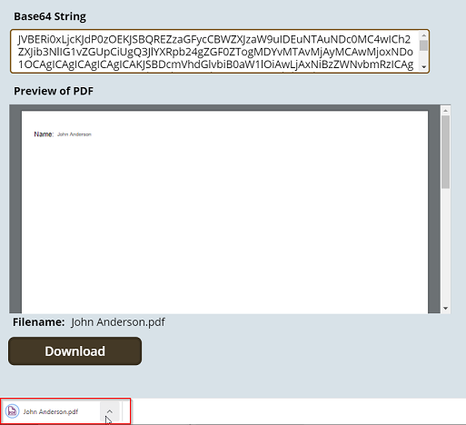
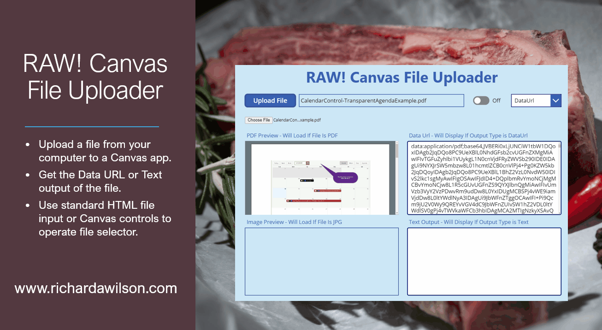
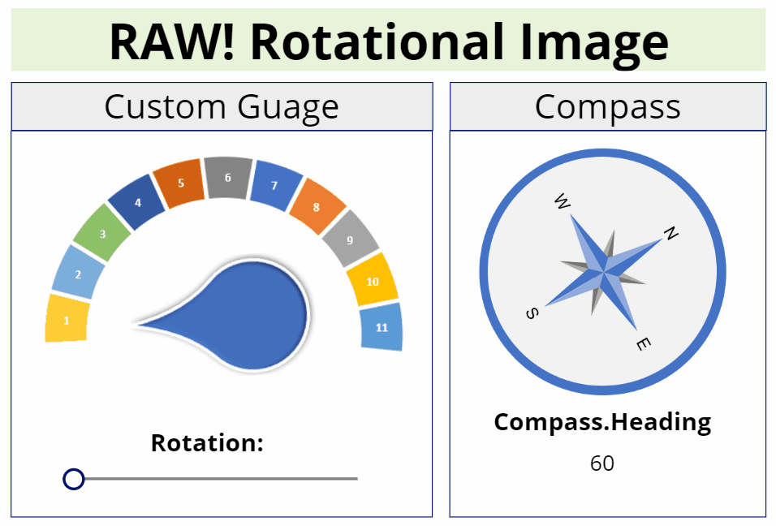

# Description
Reusable PowerApps Component Framework (PCF) components.

# Components

## Calendar/Resource Manager

Provides calendar and resource management in both Model and Canvas Apps.  Canvas App developers have access to output data which will allow them to customize their own for for actions taken on the calendar.

[More...](./Calendar/README.md)  
[Download Latest](https://github.com/rwilson504/PCFControls/releases/latest/download/CalendarControl_managed.zip)

## Canvas File Downloader
This component will allow you to download a file to the client computer in a Canvas Power App by supplying it's Base64 content string instead of a Url.

[More...](./CanvasFileDownloader/README.md)  
[Download Latest](https://github.com/rwilson504/PCFControls/releases/latest/download/CanvasFileDownloaderControl_managed.zip)

## Canvas File Uploader
The component allows you to upload a file from your computer into a canvas app and return the Data Url or the Text of the file.  Data Urls in Canvas apps can be utilizes to populate other controls such as the Image or PDF viewer controls.  The text output allows you view the text contents of a file, which could be very useful in things like loading simple text, JSON, or HTML.

[More...](./CanvasFileUploader/README.md)  
[Download Latest](https://github.com/rwilson504/PCFControls/releases/latest/download/CanvasFileUploaderComponent_managed.zip)

## Rotational Image
Is an image component that will allow you to rotate the image which is not something you can do with the standard Canvas image component.  The image can be set using a url or a base64 string.   

[More...](./CanvasFileUploader/README.md)  
[Download Latest](https://github.com/rwilson504/PCFControls/releases/latest/download/RotationalImageComponent_managed.zip)

## Custom Grid/Subgrid Using Office-UI-Fabric DetailsList

Allows you to simulate the out of the box grid and subgrid controls using the Office-UI-Fabric DetailsList control.  It was built to provide a springboard when you need a customizable grid experience.  This component re-creates a mojority of the capabilities available out of the box in less than 300 lines of code and demonstrates the following: 

* Using the DataSet within a React functional component.
* Displaying and sorting data within the Office-UI-Fabric DetailsList component.
* Rendering custom formats for data with the DetailsList component such as links for Entity References, email addresses, and phone numbers.
* Displaying field data for related entities.
* React Hooks - the component uses both useState and useEffect.
* Loading more than 5k records in DataSet.
* Retaining the use of the standard ribbon buttons by using the setSelectedRecordIds function on the DataSet.
* Detecting and responding to control width updates.

[More...](./DetailListGrid/README.md)  
[Download Latest](https://github.com/rwilson504/PCFControls/releases/latest/download/DetailListGridControl_managed.zip)

## Color Picker
This color picker component utilizes React and the Office-UI-Fabric controls.

[More...](./ColorPicker/README.md)  
[Download Latest](https://github.com/rwilson504/PCFControls/releases/latest/download/ColorPicker_managed.zip)

## Bing Maps Component
Connect to bing maps and display information from a Dynamics View.

[More...](./BingMapsGrid/README.md)  
[Download Latest](https://github.com/rwilson504/PCFControls/releases/latest/download/BingMapsGridControl_managed.zip)

## Azure Maps Component
Connect to Azure maps and display information from a Dynamics View.

[More...](./AzureMapsGrid/README.md)  
[Download Latest](https://github.com/rwilson504/PCFControls/releases/latest/download/AzureMapsGridControl_managed.zip)

## Boolean Optionset
Allows you to utilize a drop down for Boolean fields on the Business Process Flow forms.

[More...](./BooleanOptionset/README.md)  
[Download Latest](https://github.com/rwilson504/PCFControls/releases/latest/download/BooleanOptionsetControl_managed.zip)

# Build
The projects within the solution were built utilizing the [XrmToolBox](https://www.xrmtoolbox.com/) - [PCF Custom Component Builder](https://www.xrmtoolbox.com/plugins/Maverick.PCF.Builder/) by Danish Naglekar.

