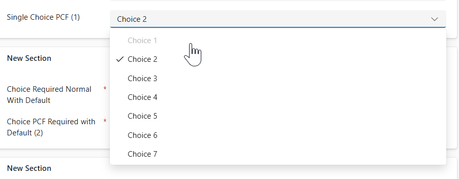

# Restricted Choice Control

## Introduction
The Restricted Choice Control is a versatile component designed to enhance user experience by ensuring that users can only select from a filtered list of options based on specified restrictions. This control dynamically adjusts the available choices in real-time, providing a seamless and intuitive interface for users to interact with complex business rules.

This control is particularly useful in scenarios where you have deprecated a choice value but need to leave it in place for existing records. By using this control, you can prevent users from selecting the deprecated value for future records while still maintaining the integrity of existing data. Additionally, you can use business rules or JavaScript to restrict values based on other data on the form, ensuring that users only see relevant options based on the context of their input.

## Shoutouts
* [Sahil Agarwal](https://www.linkedin.com/in/sk-agarwal/) who gave me this idea which he has on [pcf.gallery](https://pcf.gallery/choicerestrictor/). I love the idea but wanted to extend it to use FluentUI 9 and also include a few other features to turn on/off the restrictions.

* [Diana Birkelbach](https://www.linkedin.com/in/diana-birkelbach/) who posted this article on how to use the FluentUI 9 theming provided by the PCF context to more easily theme these components. [Read the article](https://dianabirkelbach.wordpress.com/2025/02/25/style-your-fluent-ui-9-pcfs-for-power-apps/).

* [David Rivard](https://www.linkedin.com/in/davidrivard/) whose articles and code have helped me learn and advance my knowledge of PCF, Webpack, and React. Check out his blog: [itmustbecode.com](https://itmustbecode.com/)

Thanks to all of you for being such awesome contributors to the community!

## Features
- **Multi-select support**: Supports single and multi-select choice fields.
- **Dynamic filtering**: Dynamically filters options based on provided restrictions.
- **Fluent UI integration**: Integrates seamlessly with Fluent UI components.
- **Visibility configuration**: Allows configuring restricted options visibility: set to "hide" to filter them out or "disable" to show them disabled.
- **Unselection handling**: If a record has a pre-selected restricted option, the user can unselect it; after unselection the value will be hidden or disabled so it cannot be selected again.
- **Input properties**: Provides input properties for restricted values and restrictions, which can be set manually or bound to fields. This allows dynamic updates using business rules or JavaScript.
- **Translations**: Supports multiple languages including English, Spanish, French, Korean, Japanese, German, Portuguese, and Arabic.
- **Theme**: Utilizes the built-in model app theme or any applied themes in canvas apps to ensure consistent styling and appearance.

## Available Properties

| Property Name                | Description                                                                 | Type                | Default Value |
|------------------------------|-----------------------------------------------------------------------------|---------------------|---------------|
| choiceProperty               | The property representing the choice option set.                            | OptionSet, MultiSelectOptionSet | N/A           |
| restrictedChoices            | A comma delimited list of values to restrict from the choice. eg. 100001,10002 | SingleLine.Text     | N/A           |
| restrictChoices              | Enable or disable the restriction on choices.                               | TwoOptions          | true          |
| restrictedChoiceVisibility   | Determines whether restricted choices appear as disabled (1) or hidden (0). | Enum                | 1             |

## Installation

[Download Latest](https://github.com/rwilson504/PCFControls/releases/latest/download/RestrictedChoiceControl_managed.zip)

[Import the solution file](https://learn.microsoft.com/en-us/power-apps/maker/data-platform/import-update-export-solutions)

### Model Apps

[Implementing code components for Model Apps](https://learn.microsoft.com/en-us/power-apps/developer/component-framework/code-components-model-driven-apps#implementing-code-components)

### Canvas Apps
Enable PCF for Canvas in your enviornment.  [Enable the Power Apps component framework feature](https://learn.microsoft.com/en-us/power-apps/developer/component-framework/component-framework-for-canvas-apps)

[Implementing code components in Canvas](https://learn.microsoft.com/en-us/power-apps/developer/component-framework/component-framework-for-canvas-apps#implementing-code-components)