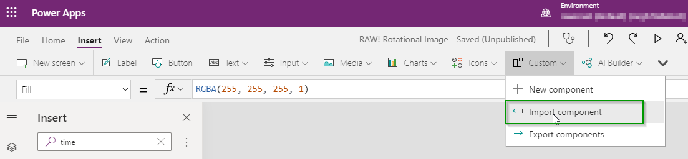
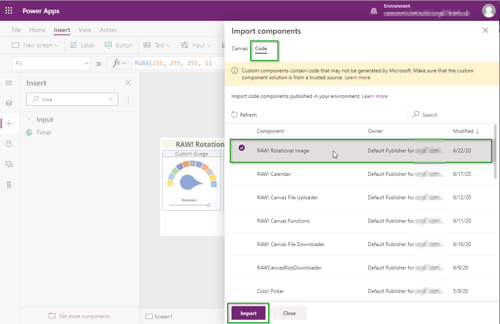
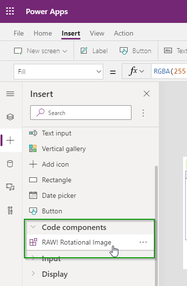
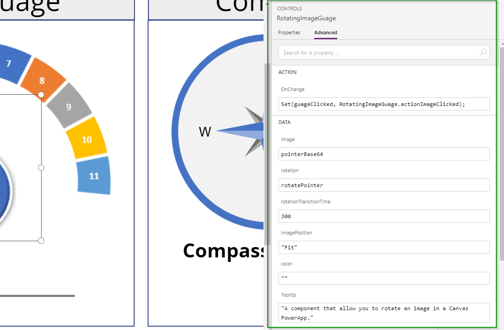
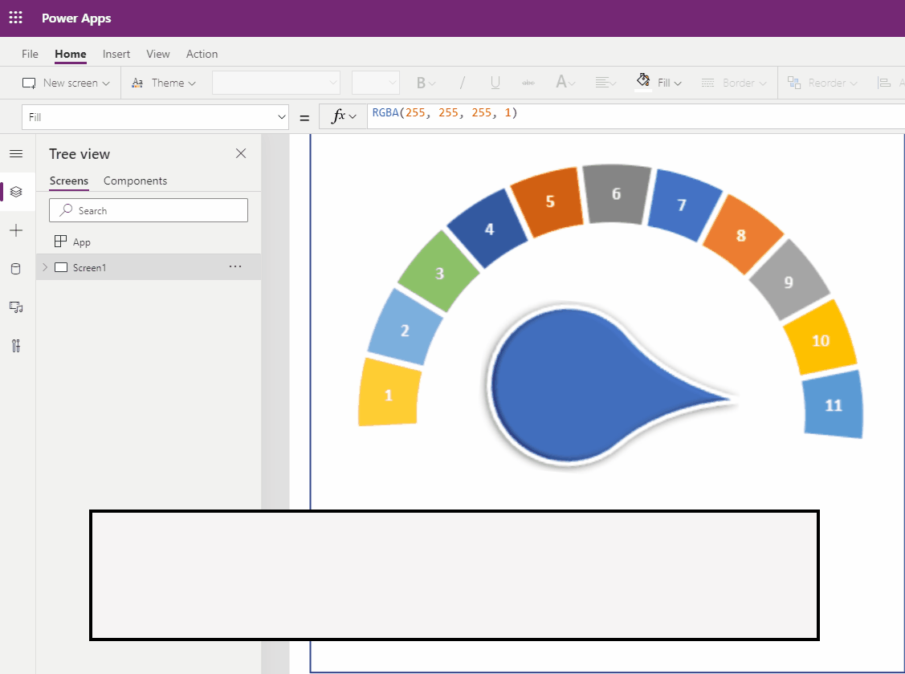

This image component allows you to rotate an image to any degree unlike the Canvas image component which only allows 90, 180, or 270 degrees.  Having full rotation of the image can allow you to build things such a compass or custom guages/indicators for your application.

## How to Configure

* Make sure you have enabled PCF components for Canvas apps in your environment.  For instructions on that [Click Here](https://docs.microsoft.com/en-us/powerapps/developer/component-framework/component-framework-for-canvas-apps)

* In the Power Apps Editor ribbon navigate to **Insert -> Custom -> Import Components**

* On the Import Component screen select the **Code** tab and Import the **RAW! Canvas File Downloader**

* Open the **Code components** area in the Insert panel and add the **RAW! Canvas File Downloader** component to the form.  The control itself will just be a blank space on the form you can utilize any other control within Canvas that has an OnSelect function to fire off the component.

* Click on the Component on the form and set the Properties for the component.
    * image (string): This can be a Url or a base64 encoded image file.  Instruction on how to get the base64 string from a media object are below.
    * rotation (decimal): This is the amount of rotation to apply to the image.
    * rotationTransitionTime (integer): The number of milliseconds the transition will take when changing the rotation.  This allows for smoother looking changes in the image.
    * color (string): Allows you to select the background color behind the image.  This color needs to be in hex format (Eg. #123456)
    * imagePosition (string/Enum): Determines how the image will fit in the control.  The options are "Center", "Fill", "Fit", "Stretch", "Tile".
    * OnChange (Event): Can be utilized to determine if the user clicked on the image.  Within the OnChange event you can utilize the output parameter called actionImageClicked to determine if the user clicked the image.

    
    

## Add Image To Media and Retrieve In Base64 Format

* Upload Images into the Media area of the Canvas App
* Create a new Variable on the App OnLoad Event to Convert the Image contents to base64 strings using the JSON function.
* Set the Image attribute of the **RAW! Rotational Image** component to the variable.

* Because the variable is attached to the App OnStart you will not see it unless you reload the app in the editor or click on the **Run OnStart** command from App in the Tree View.
