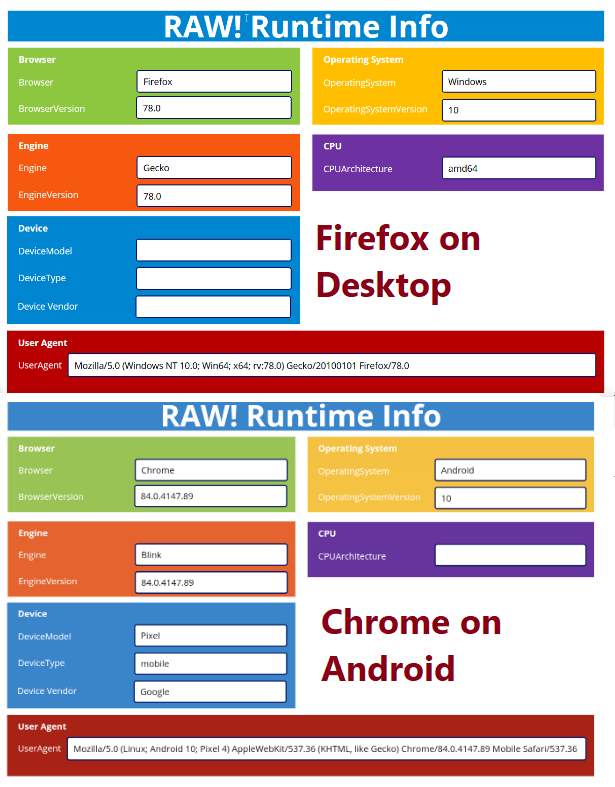
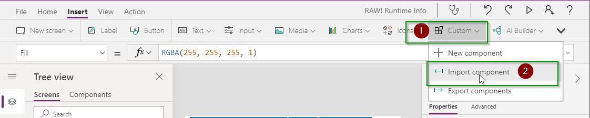
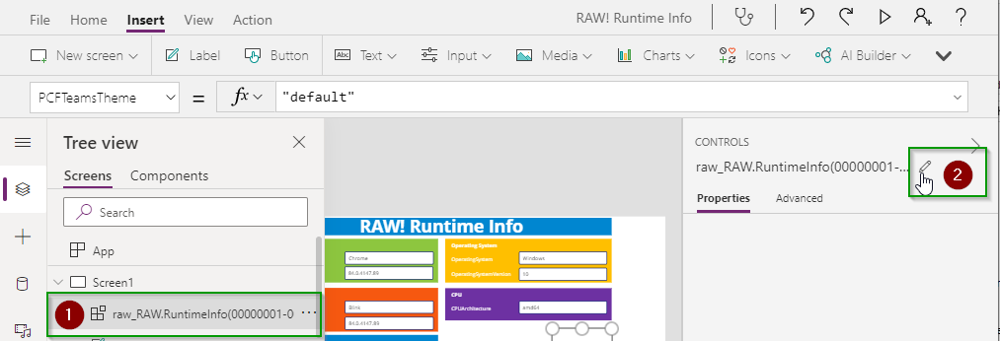
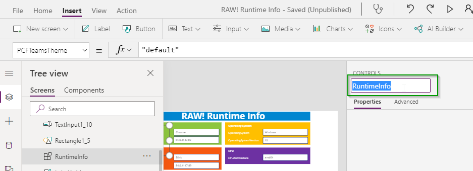
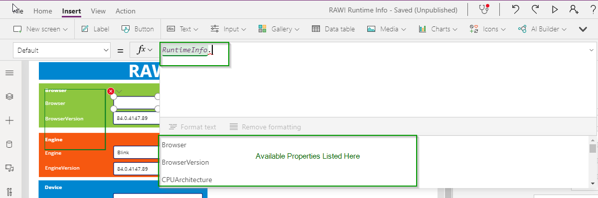

RUNTIME INFO
================

This component will allow you to get additional information about the browser and device running your Canvas App is running in.

## Installation/Usage

[Download Latest](https://github.com/rwilson504/PCFControls/releases/latest/download/RuntimeInfoComponent_managed.zip)

* Make sure you have enabled PCF components for Canvas apps in your environment.  For instructions on that [Click Here](https://docs.microsoft.com/en-us/powerapps/developer/component-framework/component-framework-for-canvas-apps)

* In the Power Apps Editor ribbon navigate to **Insert -> Custom -> Import Components**
    

* On the Import Component screen select the **Code** tab and Import the **RAW! Runtime Info**
    

* Open the **Code components** area in the Insert panel and add the **RAW! Runtime Info** component to the form.  The control itself will just be a blank space on the form.  It is suggested you rename the Component you dropped on the form to make it easier to access.

    

    

* This component does not need any properties to be set.  Instead it has a output properties which provide you with the details of the browser/device your Canvas app is running in. For additional details on the values which can be returned with these properties check out the [UAParser.js](https://github.com/faisalman/ua-parser-js) website which this component is build off of.
    * Browser
    * BrowserVersion
    * Engine
    * EngineVersion
    * DeviceModel
    * DeviceType
    * DeviceVendor
    * OperatingSystem
    * OperatingSystemVersion
    * CPUArchitecture
    * UserAgent

* Once the control is on the for you can utilize the output parameters withing controls, functions, variables, etc.
    