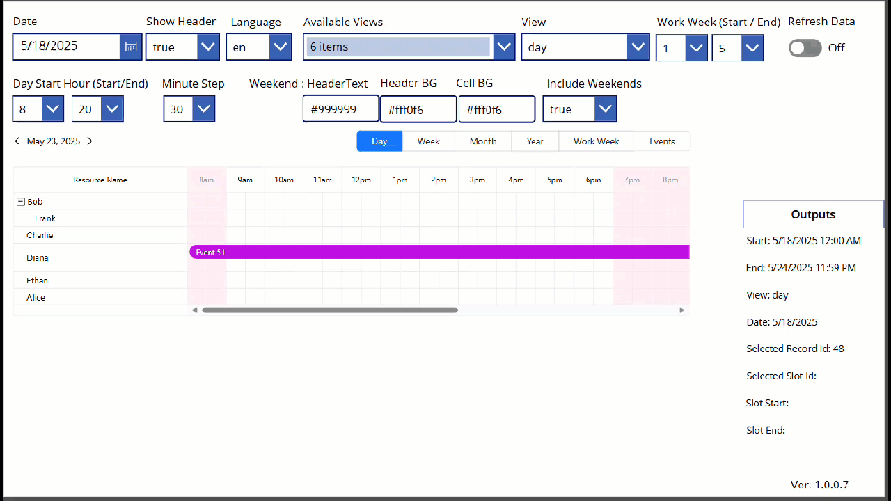

# Scheduler PCF Control

A Power Apps Component Framework (PCF) control for displaying and managing scheduled events and resources, built with React and [react-big-schedule](https://github.com/ansulagrawal/react-big-schedule).

## Overview

The Scheduler control provides a flexible, interactive calendar and resource scheduling experience for both Model-driven and Canvas Power Apps. It supports multiple languages, custom event templates, and integration with Dataverse or custom data sources.

## Features

- Resource and event scheduling with drag-and-drop support
- Multiple calendar views (day, week, month, etc.)
- Customizable event and popover templates
- Localization support for multiple languages
- Works in both Model-driven and Canvas apps
- Output parameters for event selection and date range changes
- React functional component architecture with hooks

## Installation

[Download Latest](https://github.com/rwilson504/PCFControls/releases/latest/download/RAWSchedulerComponent_managed.zip)

Import the managed solution into your environment.  
For Canvas apps, ensure PCF controls are enabled. [Enable PCF for Canvas](https://docs.microsoft.com/en-us/powerapps/developer/component-framework/component-framework-for-canvas-apps)

## Configuration

Add the Scheduler control to your form or app and configure the required properties.  
**Any field referenced in the properties must be present in your view or data source.**

### Control Properties

| Name                      | Usage    | Type                   | Required | Default      | Description                                                                                                    |
|---------------------------|----------|------------------------|----------|--------------|----------------------------------------------------------------------------------------------------------------|
| eventFieldName            | input    | SingleLine.Text        | Yes      | name         | Event Name Field schema name. For related entities: new_entityname.new_fieldname                               |
| eventFieldStart           | input    | SingleLine.Text        | Yes      | start        | Event Start Field schema name                                                                                  |
| eventFieldEnd             | input    | SingleLine.Text        | Yes      | end          | Event End Field schema name                                                                                    |
| eventColor                | input    | SingleLine.Text        | No       |              | Event Color Field schema name                                                                                  |
| eventId                   | input    | SingleLine.Text        | No       |              | Event Id Field (required for Canvas)                                                                           |
| eventFieldDescription     | input    | SingleLine.Text        | No       |              | Event Description Field schema name                                                                            |
| resourceField             | input    | SingleLine.Text        | Yes      |              | Resource Field (lookup or id)                                                                                  |
| resourceParentField       | input    | SingleLine.Text        | No       |              | Resource Parent Field (for nested resources)                                                                   |
| resourceName              | input    | SingleLine.Text        | No       |              | Resource Name (for Canvas)                                                                                     |
| resourceGetAllInModel     | input    | SingleLine.Text        | No       | false        | Get all resources (Model apps only)                                                                            |
| schedulerAvailableViews   | input    | SingleLine.Text        | No       | day,week,month,year,event | Comma delimited list of view names (day, week, month, etc.)                                                    |
| schedulerView             | input    | SingleLine.Text        | No       | week         | Default calendar view                                                                                          |
| schedulerDate             | input    | DateAndTime.DateOnly   | No       |              | Scheduler date (for Canvas)                                                                                    |
| schedulerWorkWeekStart    | input    | Whole.None             | No       | 1            | First day of work week (0-6)                                                                                   |
| schedulerWorkWeekEnd      | input    | Whole.None             | No       | 5            | Last day of work week (0-6)                                                                                    |
| schedulerDisplayWeekend   | input    | TwoOptions             | No       | true         | Show weekends in non-agenda views                                                                              |
| dayStartFrom              | input    | Whole.None             | No       | 0            | Start hour for Day view                                                                                        |
| dayStopTo                 | input    | Whole.None             | No       | 23           | End hour for Day view                                                                                          |
| minuteStep                | input    | Whole.None             | No       | 30           | Minute step for Day view                                                                                       |
| schedulerLanguage         | input    | SingleLine.Text        | No       | en           | Scheduler language/culture                                                                                     |
| showSchedulerHeader       | input    | TwoOptions             | No       | true         | Show/hide built-in scheduler header                                                                            |
| resourceNameHeader        | input    | SingleLine.Text        | No       |              | Resource Name column header text                                                                               |
| nonWorkingTimeHeadColor   | input    | SingleLine.Text        | No       | #999999      | Weekend head text color                                                                                        |
| nonWorkingTimeHeadBgColor | input    | SingleLine.Text        | No       | #fff0f6      | Weekend head background color                                                                                  |
| nonWorkingTimeBodyBgColor | input    | SingleLine.Text        | No       | #fff0f6      | Weekend body background color                                                                                  |
| isCanvas                  | input    | TwoOptions             | No       | false        | Is Canvas (hidden)                                                                                            |

### Output Properties

| Name                  | Type                    | Description                                                        |
|-----------------------|-------------------------|--------------------------------------------------------------------|
| selectedRecordId      | SingleLine.Text         | When a record is selected this will be updated                     |
| selectedSlotStart     | DateAndTime.DateAndTime | Start date of selected empty time slot                             |
| selectedSlotEnd       | DateAndTime.DateAndTime | End date of selected empty time slot                               |
| selectedSlotId        | SingleLine.Text         | Resource id of selected slot                                       |
| currentRangeStart     | DateAndTime.DateAndTime | Scheduler range start                                              |
| currentRangeEnd       | DateAndTime.DateAndTime | Scheduler range end                                                |
| currentSchedulerDate  | DateAndTime.DateOnly    | Current date the scheduler is set to                               |
| currentSchedulerView  | SingleLine.Text         | Current view the scheduler is set to                               |
| onChangeAction        | SingleLine.Text         | Action taken for OnChange event                                    |
| actionRecordSelected  | TwoOptions              | Notification that a record was selected on the calendar            |

## Sample Application

A sample solution is available for testing and demonstration:

[Download Sample App](https://github.com/rwilson504/PCFControls/raw/refs/heads/master/Scheduler/Sample/RAW!%20Scheduler%20Sample.msapp)

## Resources

- [PCF Documentation](https://docs.microsoft.com/en-us/powerapps/developer/component-framework/overview)
- [react-big-schedule](https://github.com/ansulagrawal/react-big-schedule)

